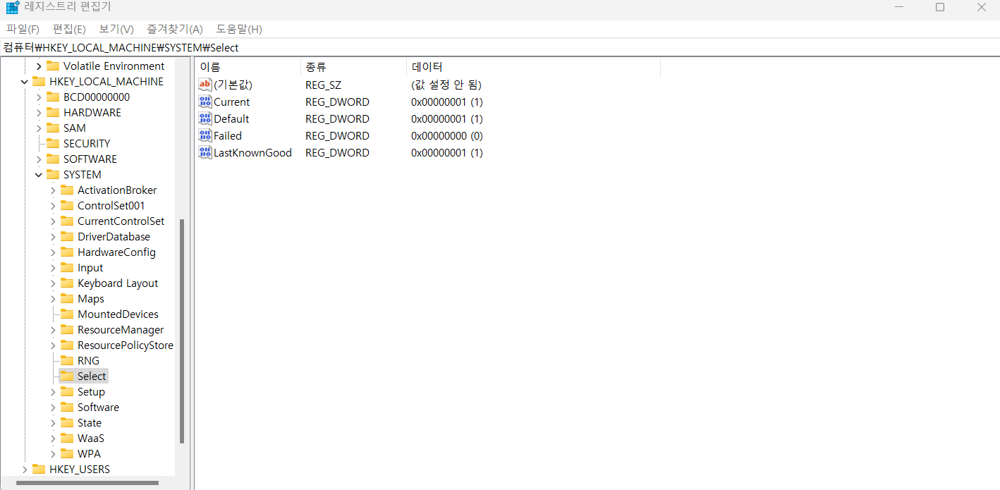
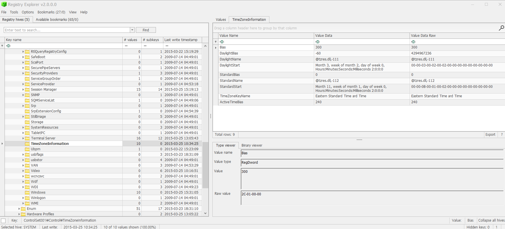

What is the timezone setting?  

윈도우에서 timezone information은 HKLM\SYSTEM\CurrentControlSet\Control\TimeZoneInformation에 존재한다.  

 
CurrentControlSet은 현재 로그인한 유저의 세팅값(Hardware profile 등)을 저장하고 있으며, 오프라인 상태에서는 ControlSetXXX을 통해 분석한다. 
ControlSetNumber는 HKLM\SYSTEM\Select의 Current Value에 저장되어 있다. 해당 값이 1이라면 ControlSet001을, 2라면 ControlSet002를 분석하면 된다.  

 
Bias가 300 분, DayLightBias가 -60분, ActiveTimeBias = Bias + DayLightBias = 240 분이므로 UTC -4가 timezone setting 값이다.  
