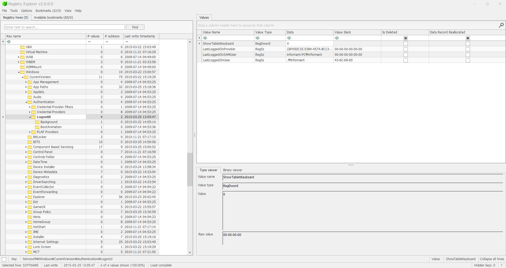

Who was the last user to logon into PC?  

마지막으로 PC에 접속한 user를 묻고 있다.  

위 내용을 확인할 수 있는 레지스트리 경로는 다음과 같다. 
HKLM\Software\Microsoft\Windows\CurrentVersion\Authentication\LogonUI  

 
위 사진에서 확인해 볼 수 있듯이, 마지막으로 PC에 접속한 user는 
lastLoggedOnUser의 informant이다. 
