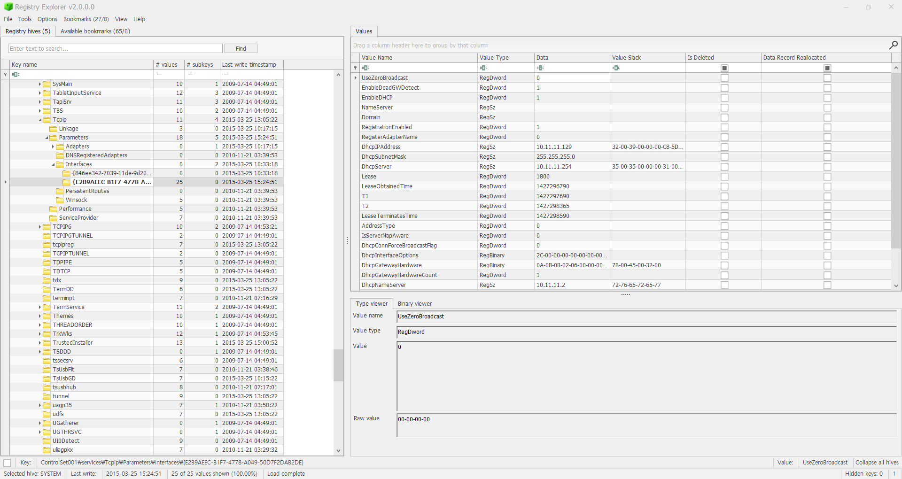

Explain the information of network interface(s) wiht an IP address assigned by DHCP. 
DHCP에 의해 IP 주소가 할당된 네트워크 인터페이스의 정보를 설명하라는 문제이다.  

\HKLM\System\ControlSet001\services\Tcpip\Parameters\interfaces\[하위키]  
  

 
Windows FILETIME (64 bit) 부분의 2015-03-25, 15:31:05이다.
