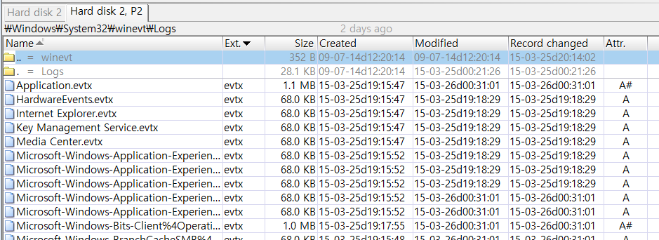
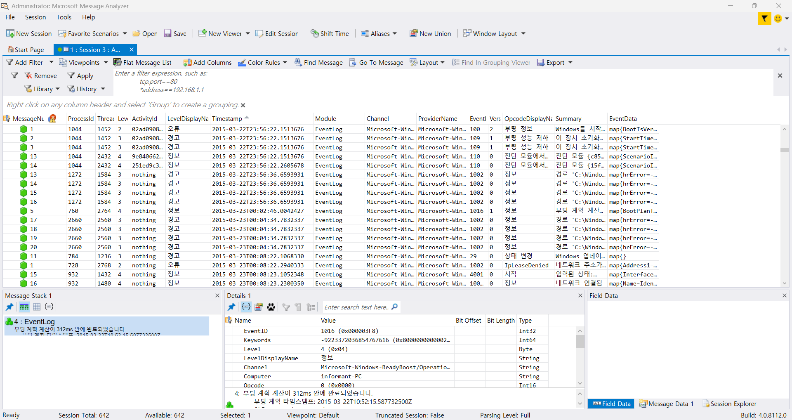

List all traces about the system on/off and the user logon/logoff. 
(It should be considered only during a time range between 09:00 and 18:00 in the timezone from Question 4.)  

간단하게 해석해보자면, "시스템의 전원 켜짐/꺼짐 및 사용자 로그인/로그오프에 대한 모든 로그를 나열하시오.   
(단, **질문 4에서 지정된 시간대**에 따라 **오전 9시부터 오후 6시까지의 시간 범위**만 고려해야 함)."  

이벤트 로그 분석들은 다음과 같은 툴을 사용해 볼 예정이다. 
Microsoft Message Analyzer, LPS(Log Parser Studio) 좀 오래된 도구들이긴 하다.  

 
이번에는 WinHex로 분석 PC 이벤트 로그를 추출하기 위해서 %systemroot%\System32\winevt의 Logs 폴더를 추출 할 예정이다.(참고로 WinHex를 사용할 때, partition 관련 창이 보이지 않는다면, WinHex를 관리자 권한으로 실행했는지 확인해야한다.)  

Microsoft message analyzer를 통해 해당 로그를 불러온 후 필터링을 한다. 

 
