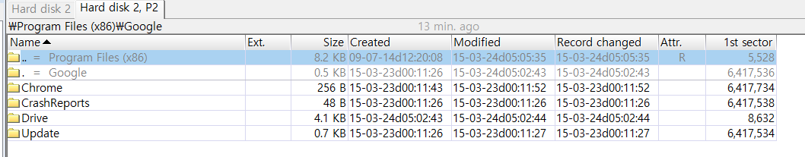
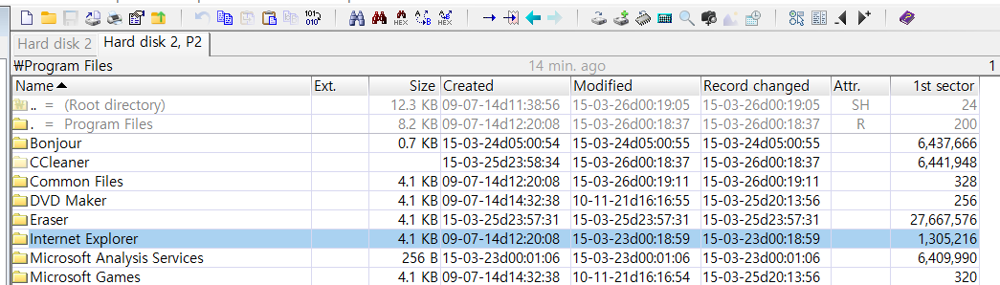

What web browsers were used?  

어떤 웹 브라우저들이 사용되었는가를 묻고 있다.  

Winhex로 프로그램의 설치 경로를 확인할 것이다. 

Program Files 혹은 Program Files(x86)의 파일들을 확인해 보면, 

  
다음 사진에서 보이듯 Chrome과 Internet Explorer를 사용하고 있는 것을 볼 수 있다.

10~11에서 확인한 방법으로 .lnk 파일(링크파일)을 분석하는 방법 또한 존재한다.
