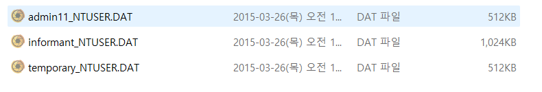
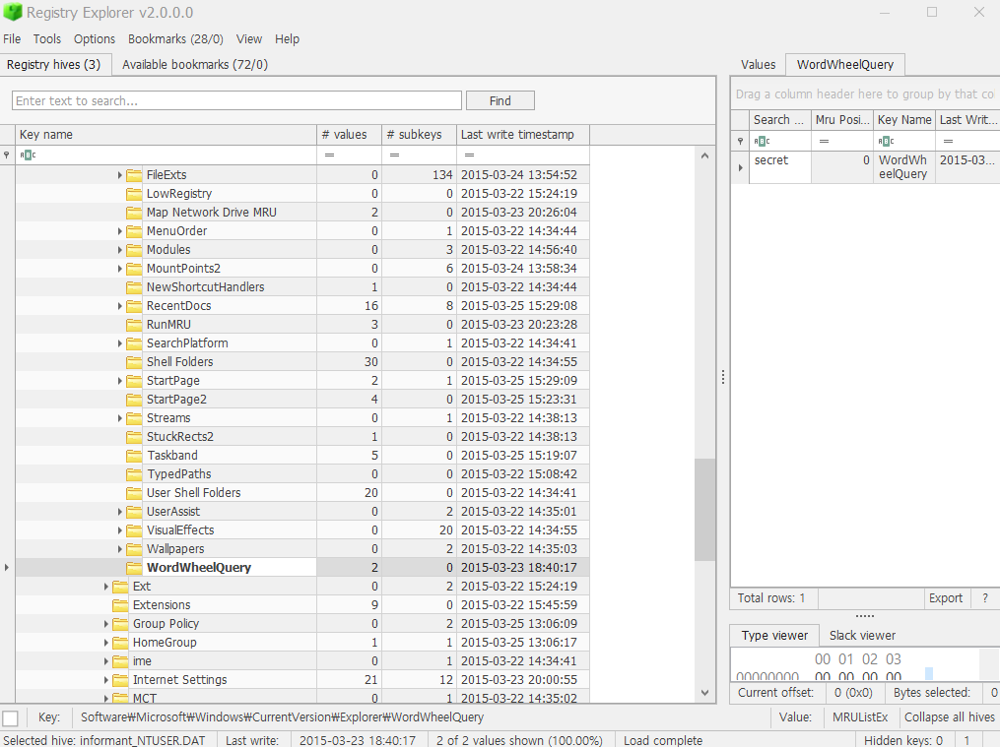

List all user keywords at the search bar in Windows Explorer. (Timestamp, Keyword)  

Windows 탐색기 검색창에서 사용자가 입력한 모든 키워드를 나열하면 된다. (타임스탬프, 키워드)  

분석할 레지스트리는 다음과 같다. 
HKEY_CURRENT_USER\SOFTWARE\Microsoft\Windows\CurrentVersion\Explorer\WordWheelQuery  

 
우선 FTK Imager를 사용해서 다음과 같이 admin_11, informant, temporary의 NTUSER.DAT을 각각 뽑아내서 Registry Rexplorer로 탐색해 볼 예정이다.  

 
admin_11, informant, temporary 중에 WordWheelQuery 파일이 존재하는 곳은 informant 뿐이었다.
