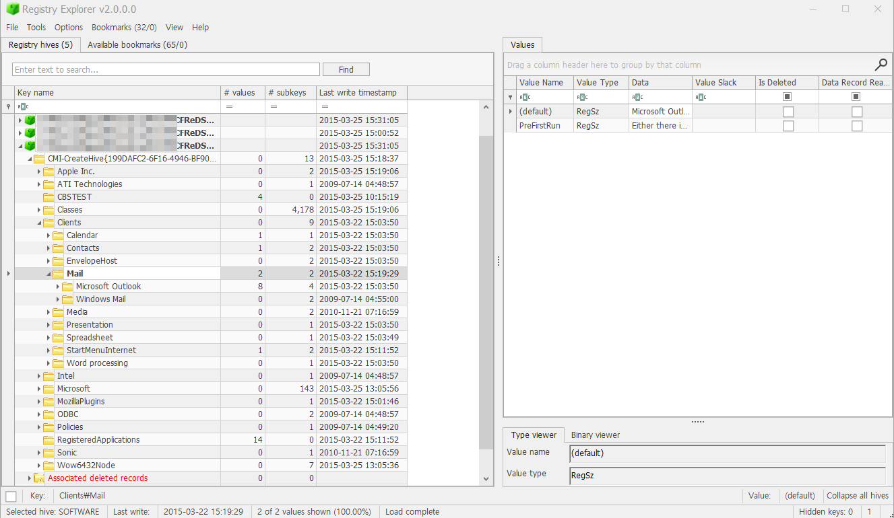
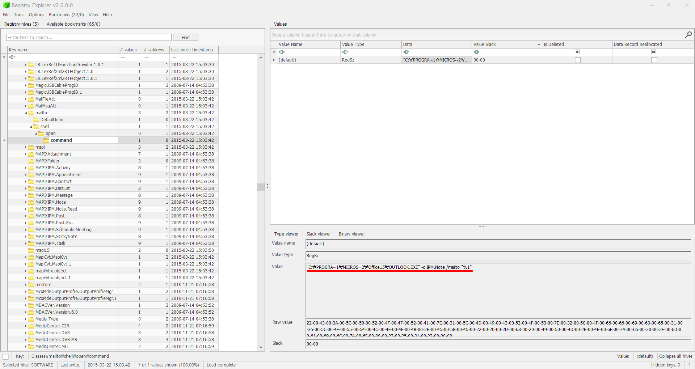

What application was used for e-mail communication?  

사용자가 e-mail을 사용할 때 어떤 프로그램을 사용했는 지를 묻고 있다.  

이를 확인하기 위해서, 다음 레지스트리를 분석해 볼 예정이다.  

HKLM\SOFTWARE\Clinets\Mail, HKLM\SOFTWARE\Classes\mailto\shell\open\command  

 
사진에서 확인해 볼 수 있듯이, Microsoft Outlook과 Windows Mail이라는 것을 확인할 수 있었다.  

 
2번째 레지스트리에서는 OUTLOOK 프로그램을 사용한 것도 확인할 수 있었다.
