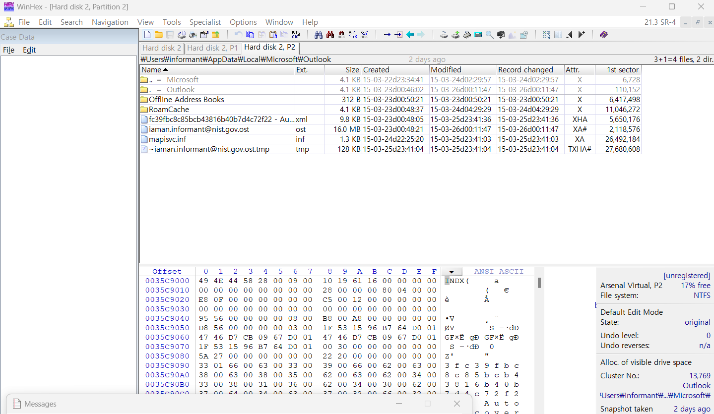

Where is the e-mail file located?  

e-mail 파일의 위치를 묻고 있다.  

일반적으로, Microsoft Outlook의 파일은 Windows 11 기준으로 C:\Users\<사용자 이름>\AppData\Local\Microsoft\Outlook\에 위치하고 있다.  

Outlook에서 이메일을 아카이브를 했다면 기본적으로 PST 파일에 저장이 되며 그 위치는 
C:\Users\<사용자 이름>\Documents\Outlook Files\이다.  

   

# Outlook `.pst` 파일 vs `.ost` 파일 차이점

## 1. **기본 정의**

| **파일 형식**   | **설명**                                                                                        |
| --------------- | ----------------------------------------------------------------------------------------------- |
| **`.pst` 파일** | - **Personal Storage Table**의 약자 - 로컬에 이메일 데이터를 영구 저장                       |
| **`.ost` 파일** | - **Offline Storage Table**의 약자 - 서버 데이터를 오프라인에서 사용할 수 있도록 로컬에 캐싱 |

---

## 2. **주요 차이점**

| **특징**           | **.pst 파일**                          | **.ost 파일**                           |
| ------------------ | -------------------------------------- | --------------------------------------- |
| **저장 위치**      | 사용자가 설정한 로컬 디렉토리          | 기본적으로 로컬 디렉토리에 자동 생성    |
| **계정 유형**      | POP3, 아카이브 데이터                  | IMAP, Exchange, Microsoft 365           |
| **서버 동기화**    | 서버 동기화 없음                       | 서버와 동기화 가능                      |
| **오프라인 작업**  | 오프라인 작업 불가(로컬 데이터만 있음) | 오프라인에서 작업 가능(서버와 동기화됨) |
| **데이터 복구**    | `.pst` 파일 자체로 복구 가능           | 서버에서 데이터를 다시 다운로드해야 함  |
| **파일 크기 제한** | 50GB (Outlook 2010 이상에서 기본)      | 50GB (Outlook 2010 이상에서 기본)       |
| **사용 목적**      | 이메일 데이터의 영구 저장 및 아카이브  | 오프라인 상태에서 서버 데이터를 캐싱    |

---

## 3. **파일 관리**

### `.pst` 파일

- **백업 필요성**:
  - 이메일 데이터를 영구적으로 저장하므로 정기적으로 백업이 필요.
- **파일 이동**:
  - 다른 PC로 쉽게 이동 가능.
  - 손상된 경우 Outlook의 **복구 도구**를 통해 복구 가능.

### `.ost` 파일

- **복구 방법**:
  - 손상되거나 삭제된 경우 서버 데이터를 다시 동기화하여 복구 가능.
- **삭제/재생성**:
  - `.ost` 파일을 삭제하면 Outlook이 자동으로 새 파일을 생성.
  - 기본 경로: `C:\Users\<사용자 이름>\AppData\Local\Microsoft\Outlook\`.

---

## 4. **사용 사례**

| **파일 형식**   | **사용 사례**                                                                                                |
| --------------- | ------------------------------------------------------------------------------------------------------------ |
| **`.pst` 파일** | - 오래된 이메일 아카이브 - 서버 저장 용량 부족 시 로컬 저장 - POP3 계정의 이메일 백업 및 이동          |
| **`.ost` 파일** | - Microsoft 365/IMAP 계정으로 서버와 동기화된 상태에서 오프라인 작업 - 회사 환경에서 Exchange Server 사용 |

---

## 5. **요약**

- **`.pst 파일`**: 로컬에 데이터 영구 저장을 위한 파일. 백업 및 이동 가능.
- **`.ost 파일`**: 서버 데이터를 캐싱하고 동기화하는 임시 파일.

---

  
