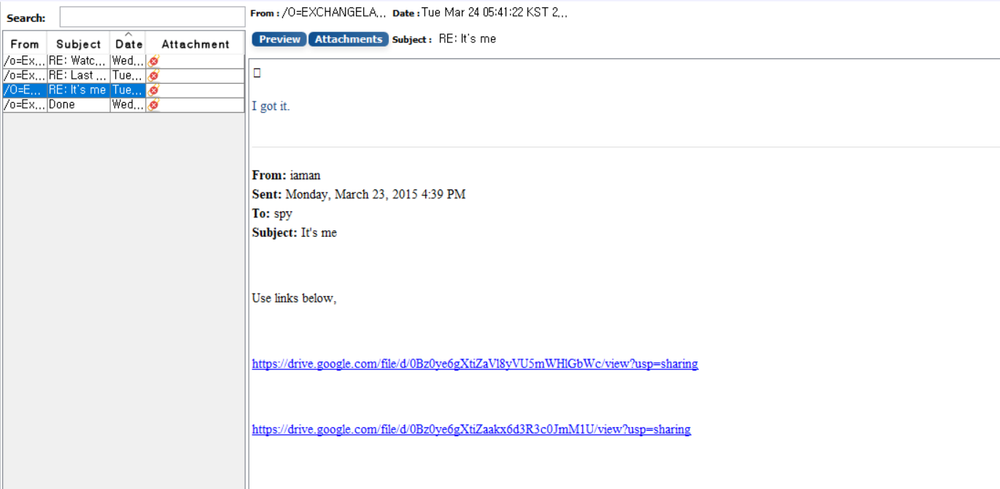

List all e-mails of the suspect. If possible, identify deleted e-mails.
(You can identify the following items: Timestamp, From, To, Subject, Body, and Attachment)
[Hint: just examine the OST file only.]  

용의자의 모든 이메일을 나열하는 문제이다. 가능하다면 삭제된 이메일도 포함해서. 
(다음 항목을 식별할 수 있다. : 타임스탬프, 발신자, 수신자, 제목, 본문, 첨부파일) 
힌트는 OST 파일만 확인하는 것이다.  

그 전에, 19, 20번에서 보았던 사진에서처럼 
WinHex를 이용해 ost 파일을 추출해 내자.(WinHex가 평가판이라서 추출이 되지 않는 사람은 FTK Imager를 사용해도 무관하다.)  

 
분석 프로그램은 FreeViewer가 안되서 DRS OST Viewer 데모 버전을 이용하였다.  

사진은, 추출해 낸 ost 파일을 업로드해서 Deleted Items 목록을 보고 있는 화면이다.  

 
삭제 된 메일 중 한 곳에서 구글 드라이브 링크 2개를 확인할 수 있었다.  

아쉽게도 구글 드라이브에서 파일이 내려간 듯 하다...  

본래, 파일이 내려가지 않았으면 파일 2가지를 다운 받아서 AUtopsy를 이용해 첨부파일을 분석할 수 있다.  
