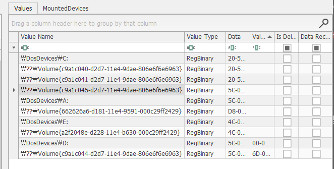

List external storage devices attached to PC.  

PC에 연결된 추가 용량 기기들의 목록을 나열하면 된다.  

PC에 연결된 외부 저장 장치를 확인하려면, Windows 기준으로 Windows 이벤트 로그(Event Viewer -> Windows Logs -> System)와 레지스트리(HKEY_LOCAL_MACHINE\SYSTEM\CurrentControlSet\Enum\USBSTOR), Prefetch 또는 SetupAPI 로그(SetupAPI : C:\Windows\INF\setupapi.dev.log, Prefetch : C:\Windows\Prefetch)를 확인하면 된다.  

우선, SetupAPI 먼저 보려고 한다.  

 
최신 버전 Windows 기준으로 C:\Windows\INF\setupapi.dev.log 위치해 있지만, 
우리가 분석하는 파일은 구 버전이기 때문에, %SystemRoot%\inf\Setupapi.dev.log를 찾으면 된다.  

 
FTK Imager로 Log를 미리 확인할 수 있는데, 디바이스가 연결되었을 때의 드라이버 설치과정과 최초 연결 시각이 기록되어 있다.  

기록되는 시간 값이 분석대상 PC의 timezone이 적용이 된 localtime으로 기록이 되고 있다. 
이 말이 무슨 말이냐 하면, 
"localtime으로 기록"된다는 말은, 해당 PC의 시간대 설정에 따라 시간 기록이 저장된다는 뜻이며, 로그 분석 시 이 시간대를 확인하고 필요하면 UTC로 변환해야 한다는 것이다.  

다음은, 레지스트리 분석을 위해 이 곳으로 가자. 
HKEY_LOCAL_MACHINE\SYSTEM\CurrentControlSet\Enum\USBSTOR  

 
위 사진과 같이, Disk&Ven_SanDisk&Prod_Cruzer_Fit&Rev_2.01이라는 USB 명과 
시리얼 넘버, 처음으로 연결된 시각을 볼 수 있다.  

 
다음은 같은 SYSTEM의 MountedDevices를 보고 있는 사진이다. 
MountedDevices 레지스트리 키에 있는 {} 안의 값들은 각각 저장 장치의 고유 식별자(GUID)를 나타낸다.  

 
이벤트 로그를 분석하기 위해 FTK Imager를 사용하여 winevt 쪽을 보고 있었는데, 
해당 이벤트 로그가 PC에 기록이 되어 있지 않은 것으로 보아, 안티포렌식을 한 모양이다.  

이 외에도, USB Forensic Tracker와 같은 도구를 사용해 이미지를 마운트해서 간편하게 보는 방법도 존재한다.
