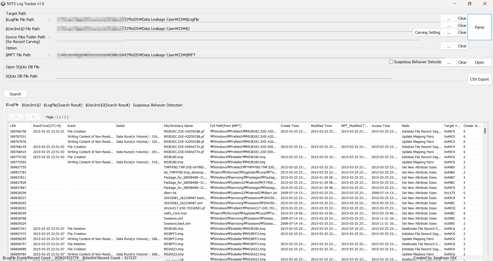
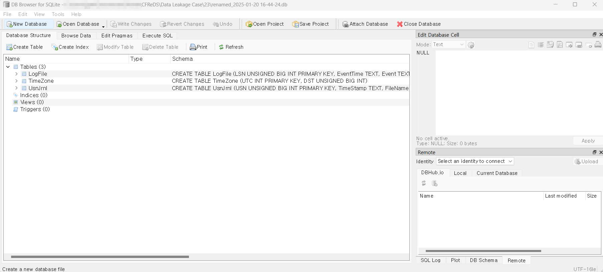
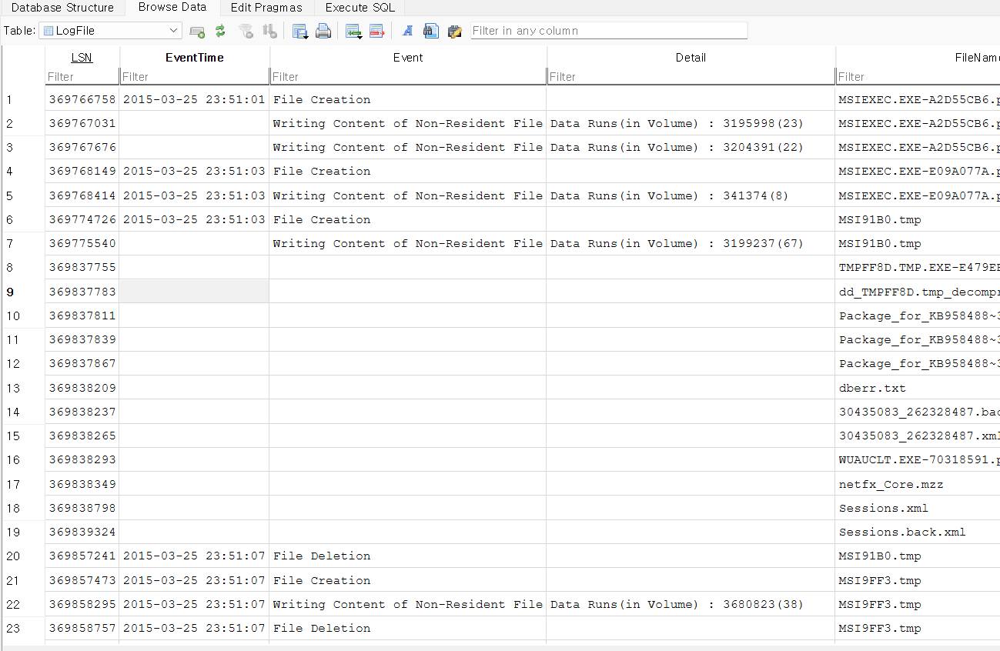

Identify all traces related to ‘renaming’ of files in Windows Desktop.
(It should be considered only during a date range between 2015-03-23 and 2015-03-24.)
[Hint: the parent directories of renamed files were deleted and their MFT entries were also overwritten. Therefore, you may not be able to find their full paths.]  

Windows Desktop에서 파일 '이름 변경(renaming)'과 관련된 모든 흔적을 찾으면 된다. 
(2015-03-23에서 2015-03-24 사이의 날짜 범위만 고려해야 한다.) 
[힌트: 이름이 변경된 파일의 상위 디렉터리는 삭제되었으며, 해당 디렉터리의 MFT(Master File Table) 항목도 덮어쓰기되었다. 
따라서 해당 파일의 전체 경로를 찾지 못할 수 있다.]   

NTFS Log Tracker를 사용할 예정이다. 
NTFS Log Tracker를 사용하기 위해서는 $UsnJrnl과 $MFT와 $LogFile이 필요하다. 
각각 위치는 C:\$Extend\$UsnJrnl:$J> 
C:\$MFT 
C:\$LogFile이다.  

자세히 모르겠다면 Dreamhack 문제 푼 레포(https://github.com/magical-to/ctf_writeup/tree/main/wargame) 참고하면 될 것 같다.  

  
다음과 같은 결과가 나오면 되는 것이다.  

그렇게 나온 데이터베이스 파일을 DB Browser(for SQLite)를 이용하여 볼 것이다.  

 
위 사진과 같이 테이블이 보이면 된다.  

 
Browser Data에서 다양한 기록들을 볼 수 있다. 
LogFile 분석 데이터에서는 EventTime과 파일 생성 시각, 파일 이름과 생성 경로 등을 확인할 수 있다. 
UsnJrnl에서는 타임스탬프를 확인할 수 있고 파일에 어떠한 이벤트들이 발생한 지 알 수 있다.
