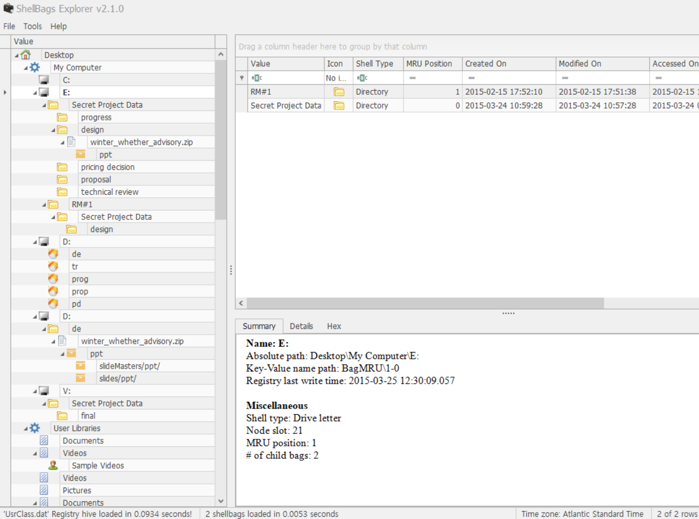

List all directories that were traversed in ‘RM#2’. 
List all files that were opened in 'RM#2’.  

'RM#2'에서 탐색된 모든 디렉토리와 'RM#2'에서 열렸던 모든 파일을 나열하면 된다.  

 
다음과 같이 에릭 짐머만 선생님의 ShellBagsExplorer를 통한 방법이 있고,  

JumpList를 분석하는 방법이 있다. 
여기서 **Jump List (점프 리스트)**는 Windows 운영 체제에서 사용자가 최근에 사용한 파일, 자주 사용하는 항목, 또는 애플리케이션에서 제공하는 특정 작업에 빠르게 접근할 수 있도록 제공되는 기능이며 Windows 7 이후의 버전에서 시작 메뉴와 작업 표시줄(taskbar)에 통합되어 사용자 편의성을 높이는 역할을 한다.  

C:\Users\[UserProfile]\AppData\Roaming\Microsoft\Windows\Recent\AutomaticDestinations  

C:\Users\[UserProfile]\AppData\Roaming\Microsoft\Windows\Recent\CustomDestinations  

두 경로의 폴더를 추출해 내는 방법이 있다. 
AutomaticDestinations는 최근 사용한 목록이나 사용자가 고정시킨 목록이며, CustomDestinations는 자주 사용되는 목록이나 작업 목록이다.  
