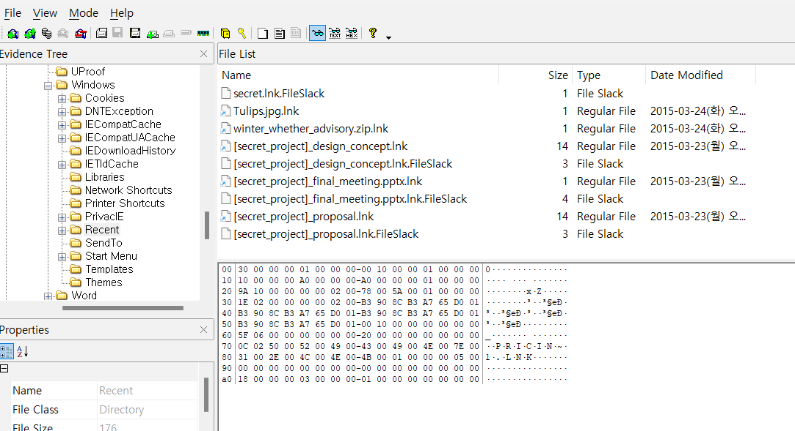
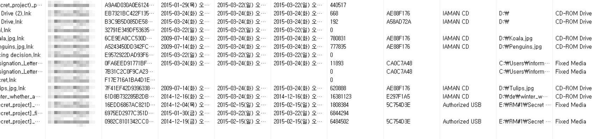

List all directories that were traversed in the company’s network drive. 
List all files that were opened in the company’s network drive.  

회사 네트워크 드라이브에서 탐색된 모든 디렉토리와 회사 네트워크 드라이브에서 열렸던 모든 파일을 나열하면 된다.  

ShellBagsExplorer를 이용해서 네트워크 드라이브의 폴더 열람 기록을 확인할 수 있으며,   

위 사진과 같이, LNK Parser를 이용해서도 확인할 수 있다.  
최근에 접근한 파일에 대한 바로 가기는 다음 디렉토리에 저장된다. 
C:\Users\<사용자 이름>\AppData\Roaming\Microsoft\Windows\Recent  

 
다음과 같이 확인할 수 있다.
