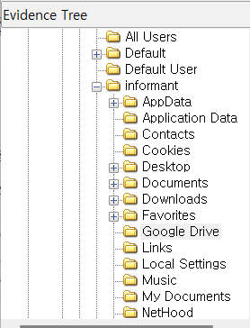
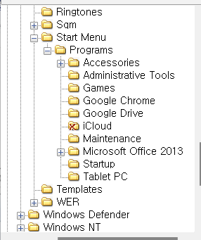

Find traces related to cloud services on PC. 
(Service name, log files...)  

PC에 클라우드 서비스 관련 흔적들을 찾아야 한다.  

그 전에 클라우드 서비스에 대해 간단하게 정의를 해보자. 
클라우드 서비스는 인터넷을 통해 데이터 저장, 처리, 소프트웨어 사용 등을 제공하는 서비스이다. 
사용자는 물리적 장비를 직접 소유하지 않고, 클라우드 제공업체의 서버를 이용해 다양한 작업을 수행할 수 있는데 대표적인 클라우드 서비스에는 Google Drive, Dropbox, OneDrive, iCloud와 같은 스토리지 서비스뿐만 아니라, AWS, Azure, GCP와 같은 클라우드 플랫폼 서비스가 있다.  

우선, 프로그램 설치 경로를 확인 해 볼 예정이다.  

### 클라우드 서비스 확인 경로

PC에서 클라우드 서비스의 흔적을 찾으려면 다음의 경로를 확인하면 된다.

#### 1. 파일 시스템

- **클라우드 동기화 폴더**
  - Google Drive: `C:\Users\[사용자명]\Google Drive`
  - Dropbox: `C:\Users\[사용자명]\Dropbox`
  - OneDrive: `C:\Users\[사용자명]\OneDrive`
  - iCloud: `C:\Users\[사용자명]\iCloudDrive`
- 특정 클라우드 서비스와 연동된 폴더 이름이나 심볼릭 링크를 확인한다.

---

#### 2. 프로그램 설치 경로

- 클라우드 동기화 프로그램이 설치되어 있는지 확인:
  - Windows: `C:\Program Files` 또는 `C:\Program Files (x86)`
  - macOS: `/Applications` 디렉토리
- 설치된 프로그램 목록에서 Google Drive, Dropbox, OneDrive 등을 확인한다.

---

#### 3. 레지스트리 (Windows 전용)

- **레지스트리 편집기**를 열고 클라우드 서비스의 흔적을 찾는다.
  - Google Drive: `HKEY_CURRENT_USER\Software\Google\DriveFS`
  - Dropbox: `HKEY_CURRENT_USER\Software\Dropbox`
  - OneDrive: `HKEY_CURRENT_USER\Software\Microsoft\OneDrive`

  

 
우선 informant 사용자에는 Google Drive 폴더가 생성되어 있는 것으로 보아, 해당 서비스를 사용한 것으로 보인다.  

 
ProgramData\Microsoft\Windows\Start Menu\Programs 위치에서도 Google Drive를 확인할 수 있고, 거기에 더해 iCloud도 볼 수 있다.  

#27을 참고하여 lnk 파일을 분석하는 방법이 있다.  
