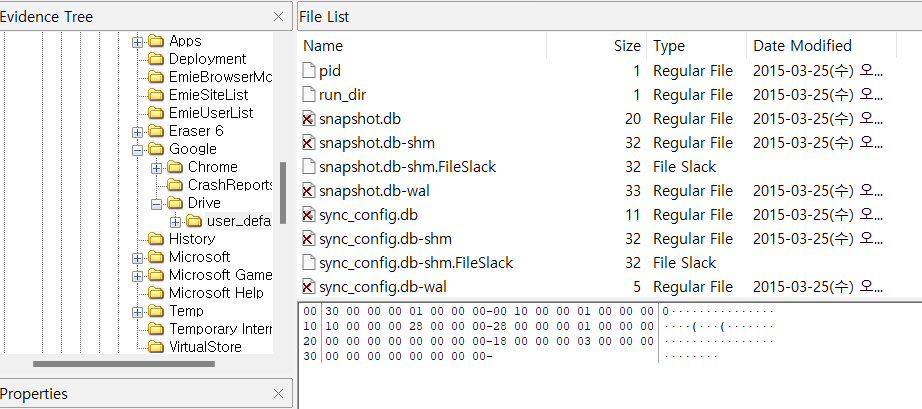

What files were deleted from Google Drive? 
Find the filename and modified timestamp of the file. 
[Hint: Find a transaction log file of Google Drive.]  

이전에 했던 내용들을 종합하는 내용이다. Google Drive에서 삭제된 파일이 무엇인지 filename과 수정된 시각을 찾으면 된다.  

힌트로는 Google Drive의 트랜잭션 로그 파일을 찾으면 된다고 한다.  

---

### 1. **Google Drive 로컬 로그 파일**

Google Drive 데스크톱 애플리케이션은 파일 동기화와 관련된 정보를 기록하는 로그 파일을 생성한다.

- **Windows**:
  - `C:\Users\[사용자명]\AppData\Local\Google\DriveFS\logs`
- **macOS**:
  - `/Users/[사용자명]/Library/Application Support/Google/DriveFS/logs`

#### 확인 방법:

- `.log` 확장자 파일을 열고 **"delete"** 또는 **"removed"** 등의 키워드로 검색.
- 파일 삭제 또는 수정 이벤트가 기록된 행을 찾아 파일명과 타임스탬프 확인.

---

### 2. **Google Drive 웹 버전**

Google Drive 웹 인터페이스에서도 삭제된 파일을 확인할 수 있다.

- **휴지통(Trash)**:

  - URL: [https://drive.google.com/drive/trash](https://drive.google.com/drive/trash)
  - 삭제된 파일의 복구 가능 여부와 삭제 타임스탬프를 확인.

- **완전 삭제된 파일**:
  - Google 관리 콘솔 또는 Google Workspace 활동 로그에서 확인 가능.

---

### 3. **Google Workspace 활동 로그** (관리자 계정 필요)

Google Workspace 계정을 사용하는 경우 **관리 콘솔**에서 활동 로그를 확인할 수 있다.

- URL: [https://admin.google.com](https://admin.google.com)
- **Reporting > Audit > Drive Audit**로 이동.
- 필터를 통해 **삭제된 파일(Deleted Files)** 이벤트 선택.
- 해당 파일명과 타임스탬프를 확인.

---

### 4. **Google Takeout**

Google Takeout을 통해 Google Drive 데이터를 내보내면 동기화된 파일 및 기록 데이터를 확인할 수 있다.

- URL: [https://takeout.google.com](https://takeout.google.com)
- 내보낸 데이터를 분석해 삭제 기록이 포함되어 있는지 확인.

---

이러한 방법들이 있지만, 우선 snapshot.db, sync_config.db를 분석할 예정이다.  

- **Windows**:
  - `C:\Users\[사용자명]\AppData\Local\Google\DriveFS\[고유ID]\snapshot.db`
  - `C:\Users\[사용자명]\AppData\Local\Google\DriveFS\[고유ID]\sync_config.db`
      

 
해당 위치에서의 snapshot.db와 sync_config.db는 X 표시로 되어있는 것으로 보아 
안티 포렌식 행위를 한 것으로 보인다.  

SQLite나 MySQL 워크벤치로 db를 확인해보아도 아무 데이터가 없다.  

동기화 로그인 sync_log.log를 분석해 볼 예정이다.  

 

아까와 같은 경로에 해당 log가 있는데 여기에서 'delete'를 키워드로 해서 검색을 해도 되고,  

 
추출을 해서 grep으로 검색을 해도 상관없다.  

deletelist.txt는 같이 업로드를 해주겠다.  

11, 18, 20번째 줄을 보면, 

### 2015-03-23 16:06:05,256 -0400 INFO pid=2576 4004:LocalWatcher common.aggregator:114 --------> Received event RawEvent(DELETE, path=u'\\\\?\\C:\\Users\\informant\\Google Drive\\How to get started with Drive', time=1427141165.24, ino=281474976785723L, parent_ino=844424930207017L, affects_gdoc=False, is_cancelled=<RawEventIsCancelledFlag.FALSE: 0>, backup=<Backup.NO_BACKUP_CONTENT: (False, False)>) None

 
이러한 코드들이 있다 
How to get started with Drive, do_u_wanna_build_a_snow_man.mp3, happy_holiday.jpg라는 3가지 파일이 삭제된 기록이 남아있다.
