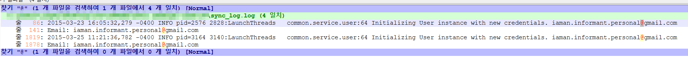

Identify account information for synchronizing Google Drive.  

Google Drive 동기화에 사용한 계정 정보를 찾으면 된다.  

이전 #30에서의 sync_log.log를 다시 한 번 볼 것이다. 
이메일 주소하면 절대 빠질 수가 없는 특수기호가 있는데, 바로 '@'이다.  

로그 파일 내에서 해당 문자를 검색해 보자.  

 
Email: iaman.informant.personal@gmail.com이라는 주소가 나오게 된다.
