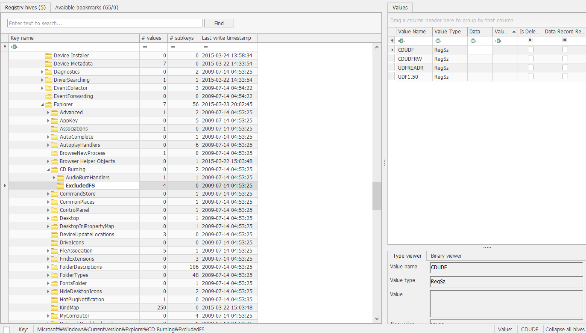
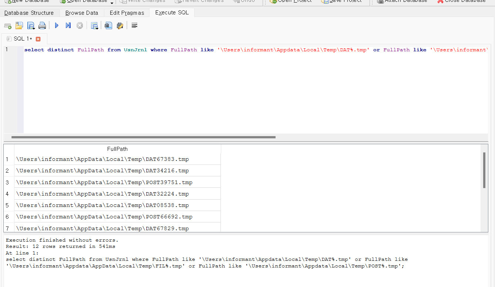

What a method (or software) was used for burning CD-R?  

CD-R을 굽는 데 사용된 방법(또는 소프트웨어)은 무엇인가??  

살펴볼 레지스트리는 다음과 같다. 
HKU\Software\Microsoft\Windows\CurrentVersion\Explorer\CD Burning\Drives\Volume{Volume_GUID}\* 
HKU\Software\Microsoft\Windows\CurrentVersion\Explorer\CD Burning\StagingInfo\Volume{Volume_GUID}\* 
HKU\Software\Microsoft\Windows\CurrentVersion\Explorer\MountPoints2\{Volume_GUID}\*  

 
여기도 허탕이다...  

임시 폴더(Burn)에 파일이 복사되고 하드가 추가된 상태에서 디스크 굽기를 실행했다면, 
파일을 %UserProfile@\Appdata\Local\Temp\DAT~.tmp로 복사되고 
Temp 폴더에 관련 정보 파일인 "FIL~.tmp", "POST~.tmp"를 생성하고 그 이벤트들이 
시스템 이벤트에 로그가 기록이 되고 임시 폴더 하위 파일이 삭제되게 된다.  

 
NTFS Log Tracker로 추출한 db 파일을 DB Browser에 넣고 sql 구문을 이용해보자. 

### select distinct FullPath from UsnJrnl where FullPath like '\Users\informant\Appdata\Local\Temp\DAT%.tmp' or FullPath like '\Users\informant\Appdata\AppData\Local\Temp\FIL%.tmp' or FullPath like '\Users\informant\Appdata\Local\Temp\POST%.tmp';

 
이 SQL 구문은 UsnJrnl 테이블에서 특정 파일 경로 패턴을 가진 고유한 FullPath 값을 검색하기 위한 쿼리다.  

사진에서 볼 수 있듯이, Temp 폴더에 DAT, FIL, POST.tmp 파일들이 있던 흔적이 있었다.  

