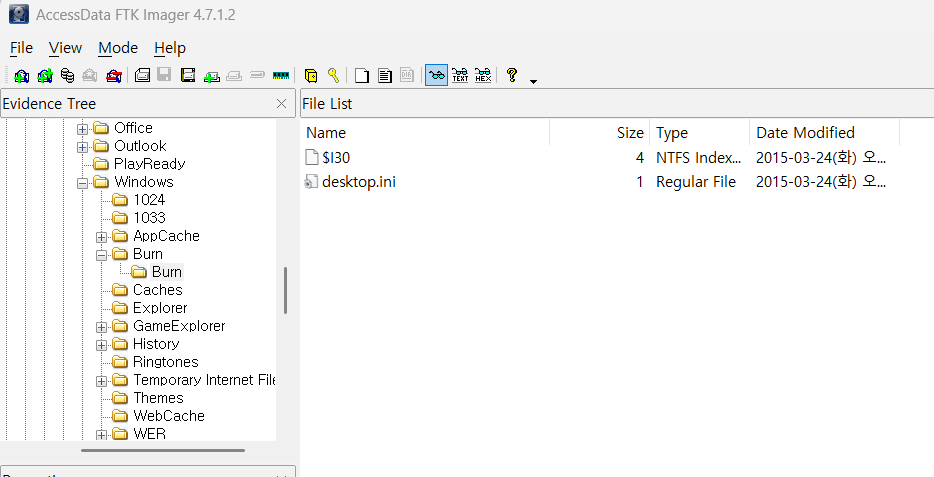

What files were copied from PC to CD-R? 
[Hint: Just use PC image only. You can examine transaction logs of the file system for this task.]  

PC에서 CD-R로 어떠한 파일들이 복사되었는 지를 확인해보자.  

우선, 확인해볼 곳은 Burn 폴더와 파일시스템 로그이다.  

 
Burn 폴더는 위 이미지와 같이 그 무엇도 남아있지 않다.  

파일 경로에 Burn이 포함된 모든 파일들의 로그를 DB Browser를 통해 확인해보면 다음과 같이 CD에서 복사 되기 전, Burn 폴더에 임시적으로 생성된 기록들을 볼 수 있다.
