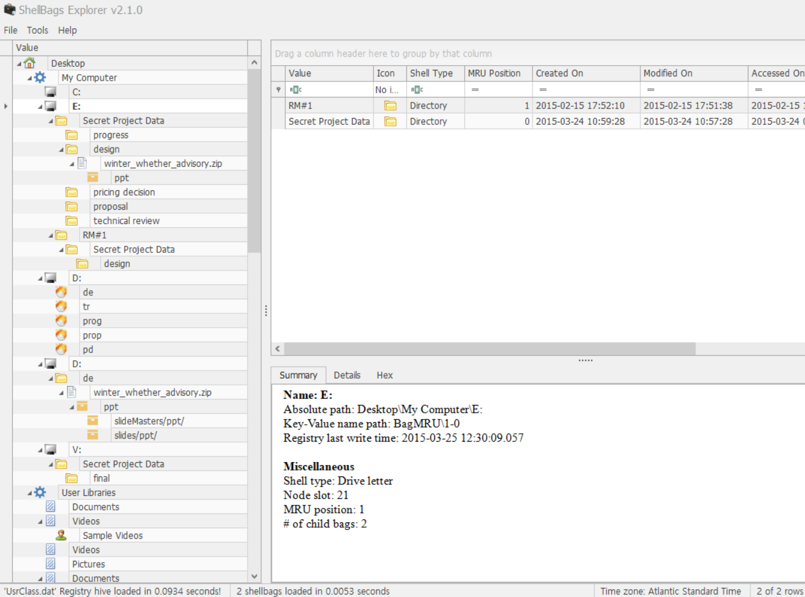
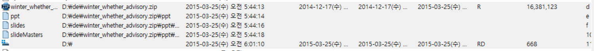
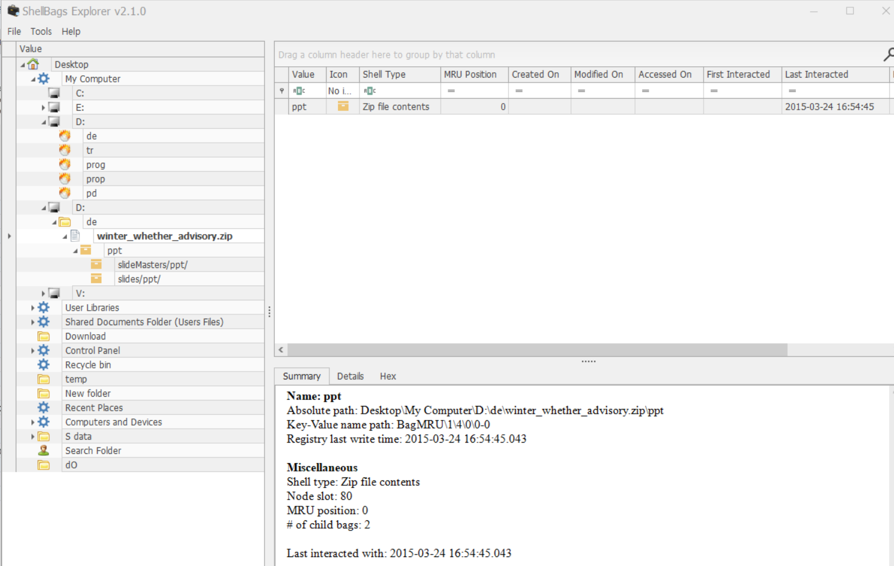

What files were opened from CD-R?  

#24~25를 참고하자.  

 
LinkParser를 통해 열어본 파일 목록을 확인 가능하지만, 
JumpListView를 통한 분석을 통해, D 드라이브에서 실행된 파일 및 폴더목록을 확인할 수도 있다.  

 
위 사진은 #JumpList 폴더에 있는 AUtomaticDestinations, CustomDestinatinos를 복구한 것을 바탕으로 JumpListView를 실행한 모습이다.  

 
위 사진과 같이, ShellBag을 사용해서도 찾을 수 있다.  

편한 방법으로 찾으면 되겠다.  
