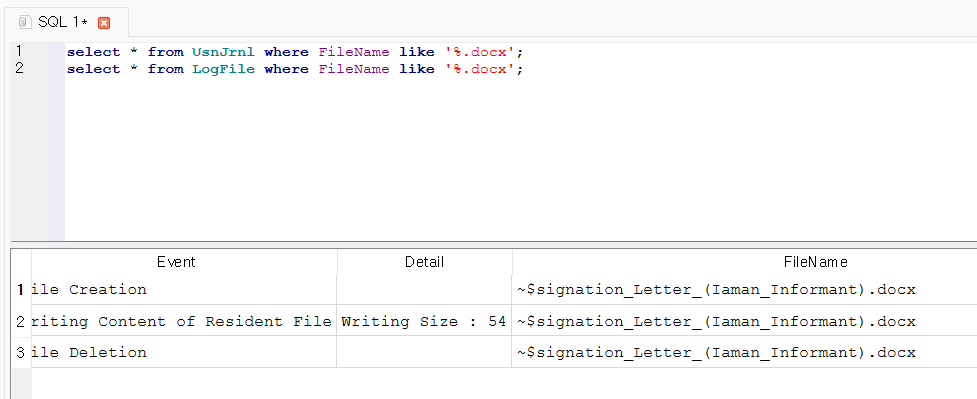

Identify all timestamps related to a resignation file in Windows Desktop.
[Hint: the resignation file is a DOCX file in NTFS file system.]  

**Windows Desktop에서 사직서 파일과 관련된 모든 타임스탬프를 식별하라.** 
[힌트: 사직서 파일은 NTFS 파일 시스템에 있는 DOCX 파일이다.]  

 
UsnJrnl과 LogFile을 바탕으로 NTFS Log Tracker을 통해 db 파일을 만들고 해당 db 파일을 DB Browser에서 sql 문을 사용하여 살펴보는 과정이다.  

파일명을 기준으로 timestamp, event를 재검색하면 된다.
