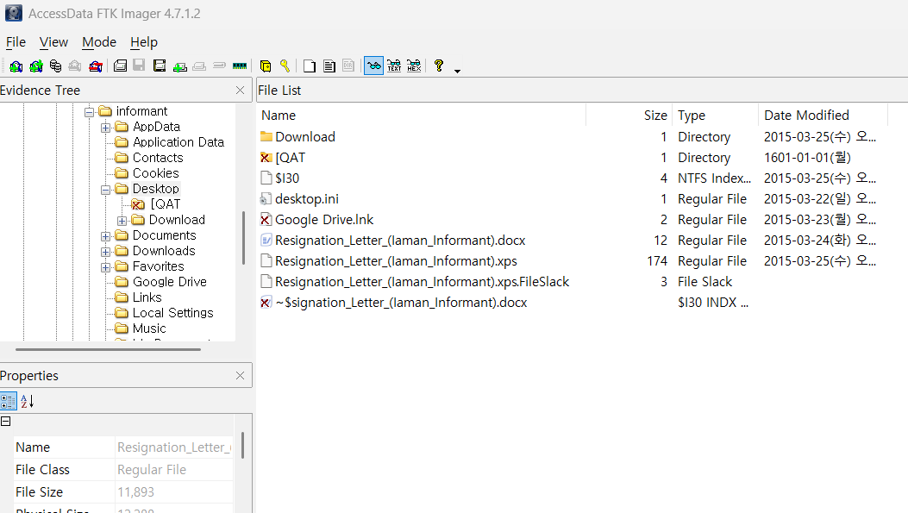

How and when did the suspect print a resignation file?  

용의자가 어떻게 그리고 언제 사직서를 출력냐고 물어보는 문제이다.  

resignation 파일이 따로 있는 줄 알았더니, 그냥 사직 관련 문서를 찾으면 된다.  

이전, #36의 글에서 DOCX file searching 부분에서 resignation file의 경로를 알 수 있다.  

 
해당 파일의 Created 시간과 Modified 시간이 보이지만, 이는 (UTC+9) 기준이므로, 
분석 대상 PC의 timezone인 UTC-4를 맞춰주어야한다.  

UTC+9 기준 2015년 3월 25일 오전 3시 48분 40초를 UTC-4로 변환하면, 2015년 3월 24일 오후 2시 48분 40초가 된다.  

UTC+9 기준 2015년 3월 25일 오전 3시 59분 30초를 UTC-4로 변환하면, 2015년 3월 24일 오후 2시 59분 30초가 된다.  

# XPS와 XPS Document Writer

## XPS란?

- XPS는 XML Paper Specification의 약자로, 전자 문서 형식 중 하나이다.
- PDF와 비슷하게 문서의 레이아웃을 고정하여 표시한다.
- 텍스트, 이미지, 벡터 그래픽을 포함하며, 다양한 기기에서 동일하게 렌더링된다.
- 기본적으로 Windows 운영체제에서 지원된다.

## XPS Document Writer란?

- XPS Document Writer는 가상 프린터 드라이버이다.
- 사용자가 문서를 프린트 명령을 통해 .xps 파일로 저장할 수 있게 한다.
- 문서를 출력할 필요 없이 디지털 형식으로 저장할 때 유용하다.
- Windows 운영체제에 기본적으로 포함되어 있으며, 출력 옵션에서 선택 가능하다.

## 활용 사례

- 문서 레이아웃을 고정하여 공유할 때 사용된다.
- 인쇄 품질을 미리 확인하거나, 문서를 안전하게 보관할 때 활용된다.
- PDF 대안으로 사용되기도 한다.

## 주요 특징

- 오픈 XML 기반 포맷을 사용한다.
- 파일 확장자는 `.xps`이다.
- Windows 10 이후부터 XPS 뷰어는 선택적 기능으로 제공된다.
