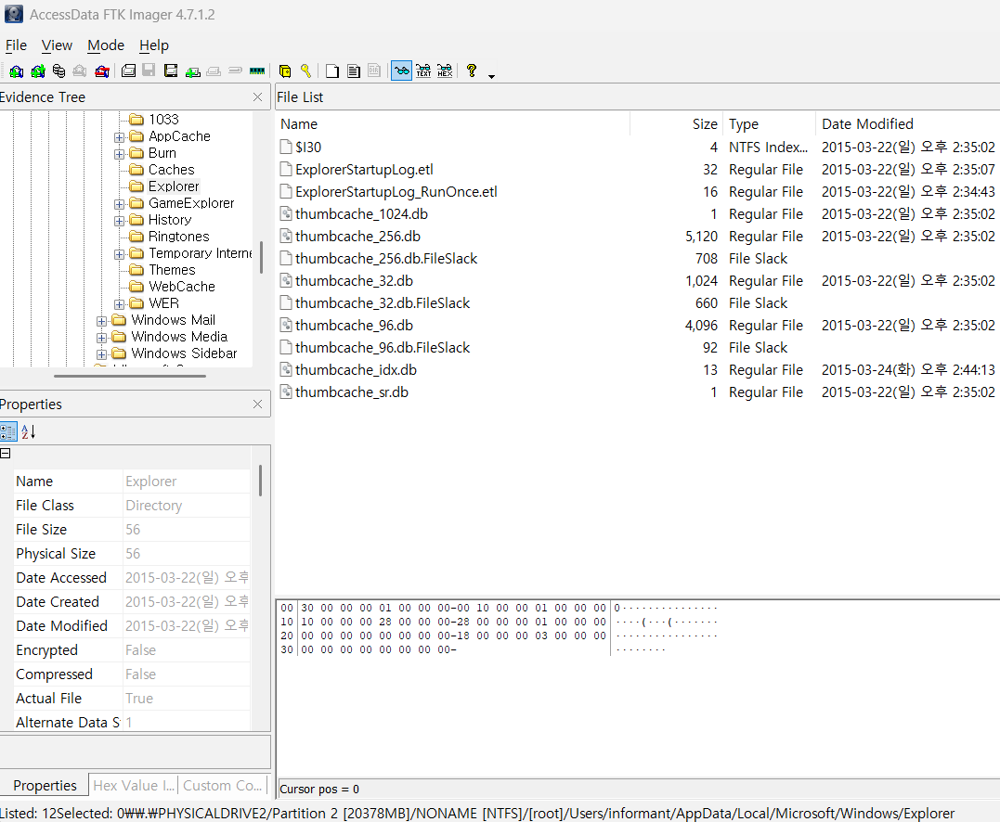

Where are ‘Thumbcache’ files located?  

Identify traces related to confidential files stored in Thumbcache.
(Include ‘256’ only)  

‘Thumbcache’ 파일은 어디에 위치하는 지를 찾고, ‘Thumbcache’에 저장된 기밀 파일과 관련된 흔적을 식별하면 된다. (‘256’만 포함)  

  
해당 파일의 위치는 다음과 같다. \Users\informant\AppData\Local\Microsoft\Windows\Explorer\thumbcache\_[size].db\  

Thumbnail Database Viewer(https://www.itsamples.com/thumbnail-database-viewer.html)  

위 프로그램을 사용하여 썸네일을 눈으로 직접 확인할 수도 있다.  
