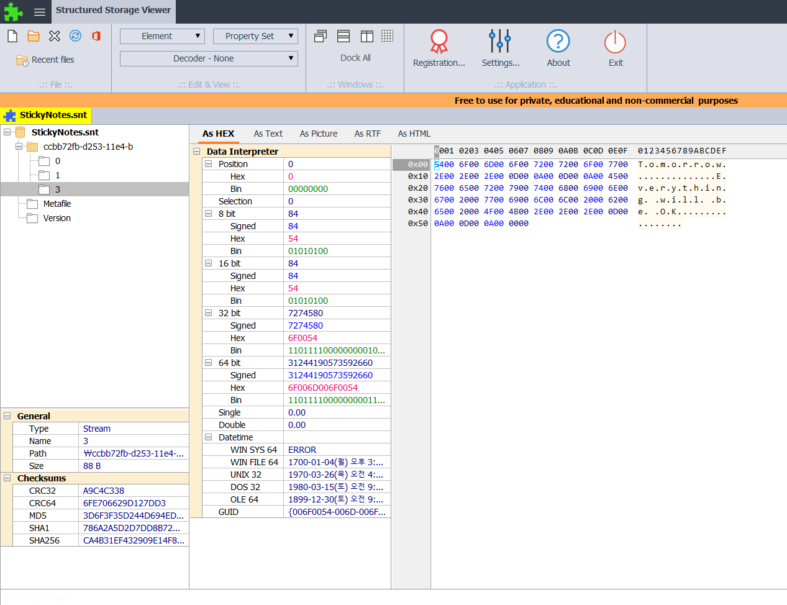

Where are Sticky Note files located? 
Identify notes stored in the Sticky Note file.  

스티키 노트 파일은 어디에 위치하는 지와 스티키 노트 파일에 저장된 노트를 알아내면 된다.  

\Users\informant\AppData\Roaming\Microsoft\Sticky Notes\StickyNotes.snt  

SNT 파일은 Microsoft Windows의 Sticky Notes(스티키 노트) 프로그램에서 사용되었던 파일 형식이다. Windows 7과 같은 구버전 운영체제에서 사용되었으며, 스티키 노트에 작성한 내용이 StickyNotes.snt 파일에 저장되었다.  

 
위 사진과 같이, 저장되었던 내용을 확인할 수 있다.
