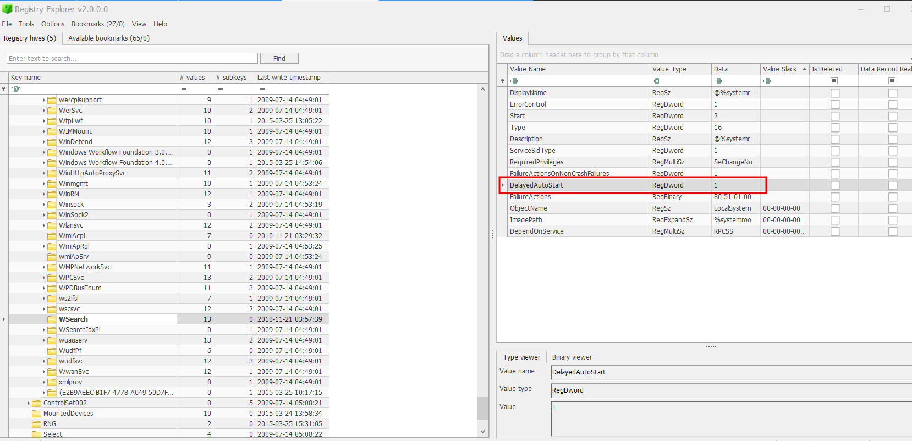
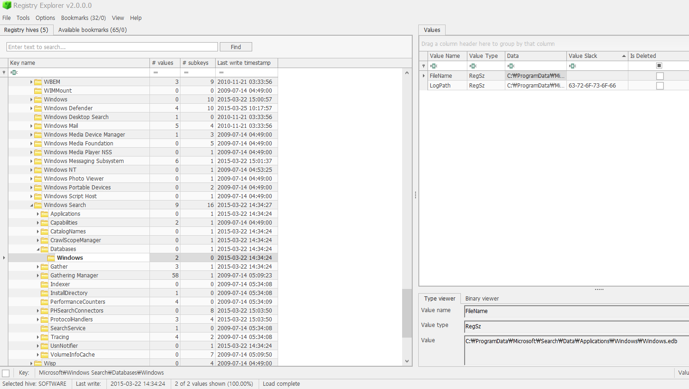
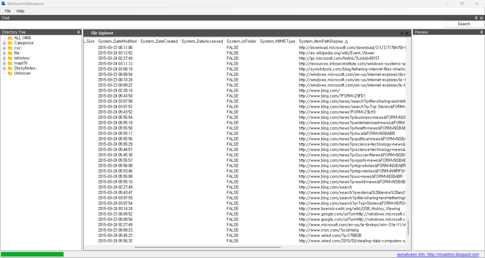
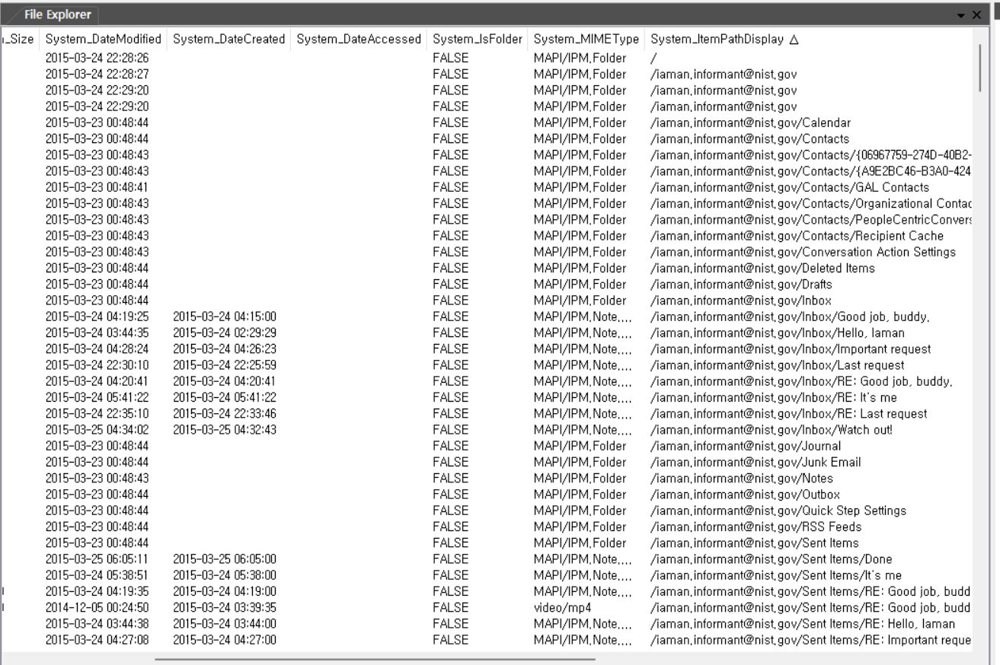
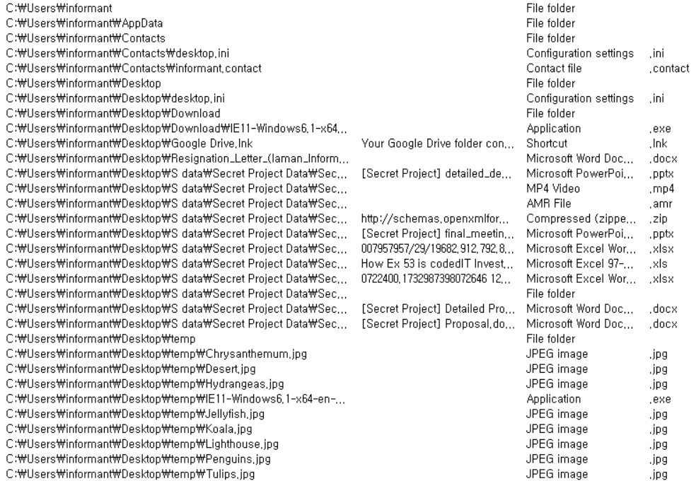

6 문제 한 번에 풀어보자...  

Was the ‘Windows Search and Indexing’ function enabled? How can you identify it?  

'Windows 검색 및 인덱싱' 기능이 활성화되어 있었는가? 이를 어떻게 확인할 수 있는가?  

HKLM\SYSTEM\ControlSet001\services\WSearch (value : DelayedAutoStart) 값이 1이라면, 윈도우 검색 및 색인 기능이 활성화 된 상태라는 뜻이다.  

 
사진에서 보면, DelayedAutoStart 값이 1이다.  

If it was enabled, what is a file path of the ‘Windows Search’ index database?  

만약 활성화 되어있었다면, Windows Search라는 파일의 경로를 묻고 있다.  

경로는 다음과 같다. 
C:\ProgramData\Microsoft\Search\Data\Applications\Windows\Windows.edb  

 
레지스트리 경로는 다음과 같이 Microsoft\Windows Search\Databases\Windows에서 
FileName의 Data의 Value 값이다.  

What kinds of data were stored in Windows Search database?  

Windows Search db에는 어떠한 종류의 데이터가 저장되는 지를 묻고 있다.  

# Windows Search 데이터베이스에 저장된 데이터

## 1. 파일 메타데이터

- 파일 이름: 색인된 파일의 이름을 저장한다.
- 파일 경로: 파일의 전체 디렉토리 경로를 저장한다.
- 파일 속성:
  - 파일 크기
  - 생성 날짜
  - 수정 날짜
  - 파일 유형/확장자
  - 작성자(문서 파일의 경우)

## 2. 파일 내용

- 텍스트 콘텐츠: 텍스트 기반 파일에서 추출한 내용을 저장한다.
  - 예: `.txt`, `.docx`, `.pdf` 등 (적절한 필터 필요)

## 3. 이메일 및 메시지 데이터

- 이메일 데이터: Microsoft Outlook과 같은 이메일 클라이언트에서 이메일 제목, 본문, 첨부 파일 정보를 저장한다.
- 메시지 정보: 일정 또는 연락처 정보를 포함한다.

## 4. 시스템 데이터

- 시작 메뉴 항목: 설치된 프로그램과 바로가기 정보를 저장한다.
- 레지스트리 정보: 검색에 필요한 특정 레지스트리 키를 저장한다.

Windows Search 데이터베이스는 검색 속도를 높이기 위해 이러한 데이터를 색인하고 저장한다.
  

Find traces of Internet Explorer usage stored in Windows Search database.
(It should be considered only during a date range between 2015-03-22 and 2015-03-23.)  

Windows Search 데이터베이스에 저장된 Internet Explorer 사용 흔적을 찾으면 된다. 
(2015-03-22부터 2015-03-23 사이의 날짜 범위만 고려해야 한다.)  

Windows Search DB Analyzer(https://drive.google.com/file/d/1QsKLSYXeXw5YkKphm-9HA7dwJ0h9Oiwc/view)를 사용하였다.  

 
2015년 3월 23일과 2015년 3월 24일 사이를 System_DateModified를 기준으로 정렬하여 확인할 수 있다.  

List the e-mail communication stored in Windows Search database.
(It should be considered only during a date range between 2015-03-23 and 2015-03-24.)  

 
Internet Explorer 사용 흔적을 찾는 것과 비슷하게 찾으면 된다.  

List files and directories related to Windows Desktop stored in Windows Search database.
(Windows Desktop directory: \Users\informant\Desktop\)  

 
