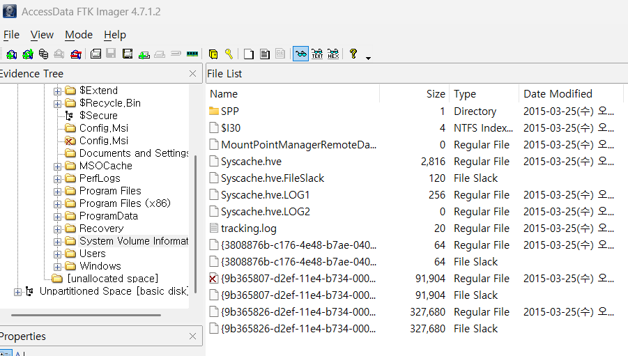
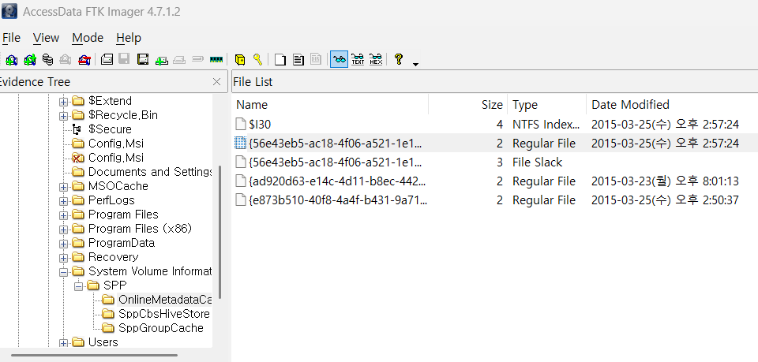
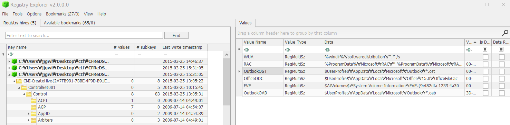

47. Where are Volume Shadow Copies stored? When were they created?  

Volume Shadow 복사본이 저장되어 있는 곳과 복사본이 생성된 시각을 물어보고 있다.  

 
System Volume Information의 위치는 의외로 멀지 않다. 
루트 폴더의 System Volume Information이 바로 그 폴더이다.  

 
물론, 시간 또한 쉽게 알 수 있다.   

48. Find traces related to Google Drive service in Volume Shadow Copy.
    What are the differences between the current system image (of Question 29 ~ 31) and its VSC?  

ShadowCopyView라는 프로그램을 사용하여 3가지 파일을 모두 찾을 수 있다. 29~31 문제를 풀때에는 시스템에서 안티포렌식 행위를 하여 파일들이 삭제되어 분석에 제한이 있었다 하면, 
해당 문제에서는 ShadowCopyView라는 프로그램을 이용해 볼륨섀도우를 통해 해당 파일들을 복구해낼 수 있다.  

참고(https://shsh010914.tistory.com/73)   

49. What files were deleted from Google Drive? 
    Find deleted records of cloud_entry table inside snapshot.db from VSC. 
    (Just examine the SQLite database only. Let us suppose that a text based log file was wiped.) 
    [Hint: DDL of cloud_entry table is as follows.] 

### CREATE TABLE cloud_entry (doc_id TEXT, filename TEXT, modified INTEGER, created INTEGER, acl_role INTEGER, doc_type INTEGER, removed INTEGER, size INTEGER, checksum TEXT, shared INTEGER, resource_type TEXT, PRIMARY KEY (doc_id));

  

# 📌 VSC(볼륨 섀도 복사본)에서 Google Drive 삭제된 파일 찾기

✅ 1) snapshot.db를 VSC에서 추출 
✅ 2) SQLite로 cloud_entry 테이블 확인 
✅ 3) removed = 1인 파일 찾기 
✅ 4) 최근 삭제된 파일 조회 (modified 값 활용) 
✅ 5) WAL 로그 분석하여 추가 복구 시도 
✅ 6) 결과를 파일로 저장 (deleted_records.txt)  

위 과정을 따르면 삭제된 Google Drive 파일 목록을 확인 및 복구 가능하다.   

50. Why can’t we find Outlook’s e-mail data in Volume Shadow Copy?  

우리가 볼륨 섀도 복사본에서 Outlook의 e-mail 데이터를 찾지 못하는 이유는 아래 이미지에서 볼 수 있다.  

  

🔥 결론: Outlook 이메일 데이터가 VSC에서 누락되는 주요 원인 
Outlook이 파일을 항상 열어둠 : .pst 및 .ost 파일이 지속적으로 변경되어 VSS가 제대로 백업하지 못함. 
.ost 파일은 기본적으로 백업되지 않음 : 서버에서 다시 다운로드할 수 있기 때문에 VSS에서 제외됨. 
.pst 파일이 크거나 VSS 제한에 걸림 : .pst 파일 크기가 크면 VSS 저장소 공간 부족으로 인해 백업되지 않을 수 있음. 
VSS 설정에서 특정 폴더가 제외됨 : Outlook 데이터 저장 폴더가 VSS 백업에서 제외되어 있을 가능성이 있음. 
Outlook의 백업 정책 변경 : 최신 Outlook 버전에서는 VSS 백업을 공식적으로 지원하지 않는 경우가 있음.  
