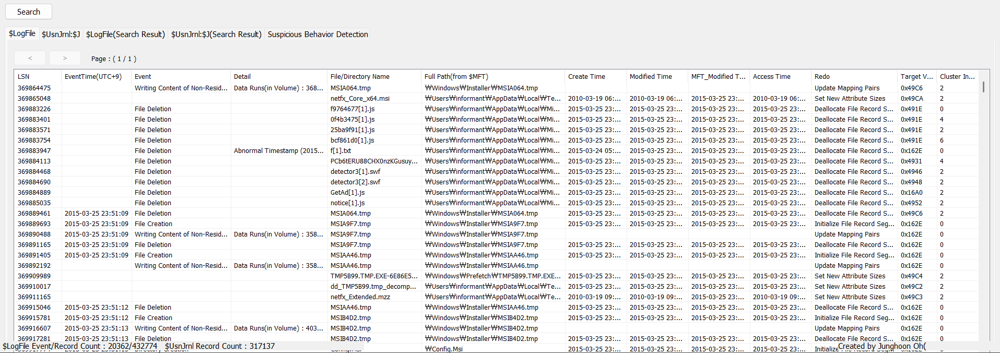
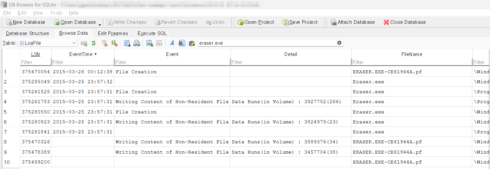

What actions were performed for anti-forensics on PC at the last day '2015-03-25'?  

2015년 3월 25일에 PC에서 어떠한 안티 포렌식 행위가 수행되었는 지를 묻고 있다.  

NTFS Log Tracker를 사용하여, 추출한 $LogFile, $UsnJrnl를 바탕으로 해당 기간에 발생한 파일 시스템 이벤트를 분석할 예정이다.  

### ~1. $LogFile (NTFS 로그 파일)~

- **~역할~**: NTFS 저널링 시스템에서 메타데이터 변경 사항을 기록하여 충돌 시 복구를 돕는 역할을 함.
- **~보존 기간~**: 특정한 기간이 아니라, 파일 크기가 가득 차면 오래된 로그가 삭제됨.
- **~크기 결정~**: `chkdsk /L` 명령어로 확인 가능.
- **~기본 크기~**: 약 **4~32MB** 정도로 설정됨.
- **~로그 관리 방식~**: 로그가 꽉 차면 **FIFO(First In First Out) 방식**으로 오래된 로그가 지워짐.
- **~크기 조정 방법~**: 사용자가 크기를 조정할 수도 있음 (`fsutil transaction setlogsize` 명령어 사용 가능).

### ~2. $UsnJrnl (Update Sequence Number Journal, USN 저널)~

- **~역할~**: 파일 변경 사항을 기록하는 저널로, 보안 및 백업 소프트웨어에서 변경 사항을 추적하는 데 사용됨.
- **~보존 기간~**: `$UsnJrnl`의 크기 제한에 따라 결정되며, 크기가 초과되면 오래된 로그가 삭제됨.
- **~크기 확인~**: `fsutil usn queryjournal C:` 명령어로 확인 가능.
- **~기본 크기~**: 기본적으로 **수백 MB~수 GB**까지 설정 가능하며, 크기가 꽉 차면 가장 오래된 항목부터 삭제됨.
- **~크기 조정 방법~**: 사용자가 직접 크기를 조정할 수도 있음 (`fsutil usn createjournal` 명령어 사용).

### ~정리~

- `$LogFile`과 `$UsnJrnl`은 **고정된 날짜 기간 동안 보존되지 않으며**, **설정된 크기가 가득 차면 오래된 로그가 자동으로 삭제**됨.
- `$LogFile`은 보통 **몇 분~수 시간 내의 변경 사항**을 보존하고, `$UsnJrnl`은 크기에 따라 **몇 시간~수 주간의 변경 기록**을 보존할 수 있음.
- 보존 기간을 늘리려면 **저널 크기를 조정**해야 함.
    

 
위 사진과 같이 NTFS Log Tracker를 이용하거나  

 
추출해 낸 db를 바탕으로 DB Browser를 통해서도 Eraser, CCleaner와 같은 프로그램을 설치하여 안티 포렌식 행위를 한 것을 확인할 수 있다. 
프리패치나 이메일 임시파일과 관련된 db, tmp 파일 등의 흔적을 삭제했다.  

Eraser를 이용해 삭제된 파일들은 
IE11 설치 파일, Jellyfish, Koala, Penguins.jpg 파일들이 있으며  

윈도우 삭제 기능을 통해서 txt들과 gif, landscape.png, my_favorite_cars.db와 같은 파일들을 삭제하였다.
