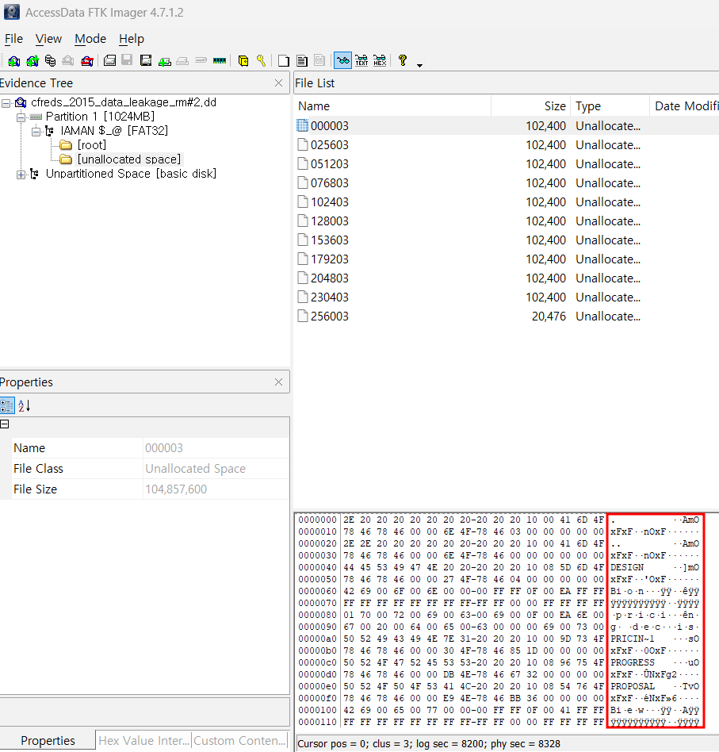
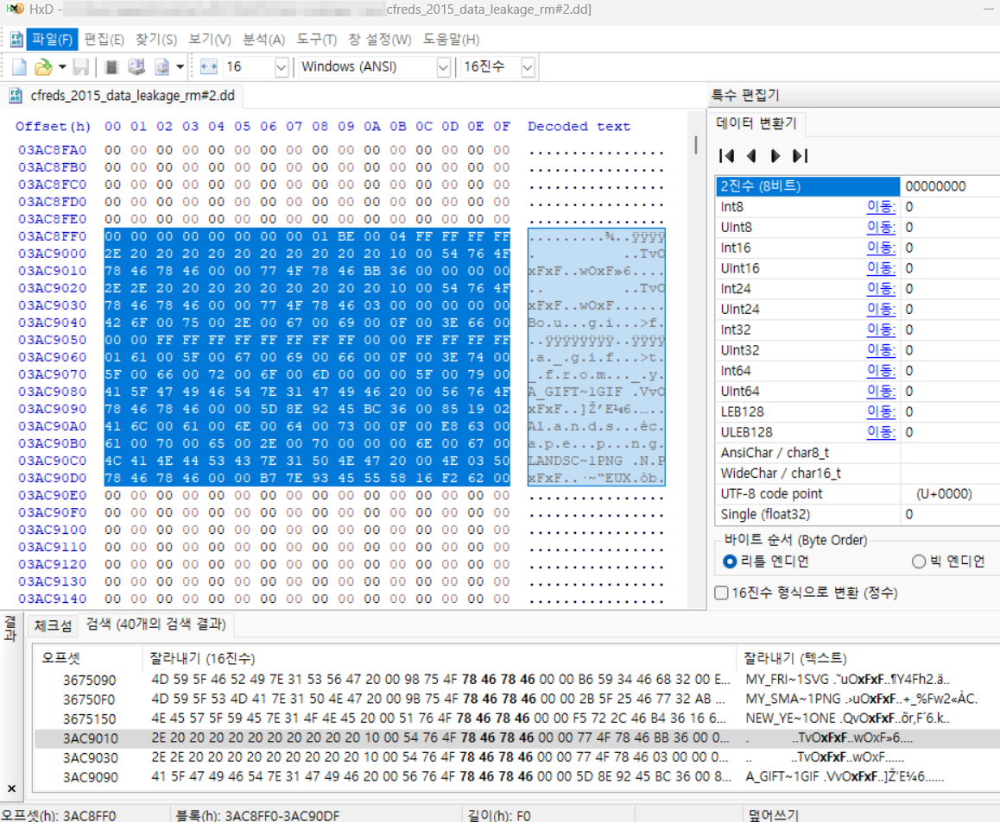
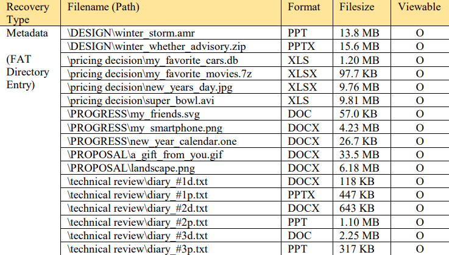
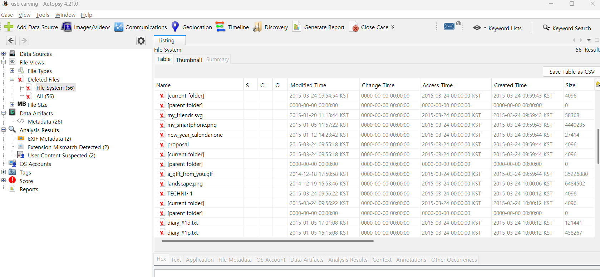

Recover deleted files from USB drive ‘RM#2’.  

RM#2라는 USB 드라이브에서 삭제된 파일을 복구하면 된다.  

위 문제를 해결하기 위해서 FTK Imager를 또 사용해 볼 것이다.  

'RM#2' 파일은 
https://cfreds-archive.nist.gov/data_leakage_case/data-leakage-case.html 
페이지에서 Personal Computer 밑에 있는 Removable Media #2를 다운받으면 된다.  

 
위 이미지는, FTK Imager를 이용해 Raw 이미지를 불러온 것이다. 빨간색으로 표시해둔 곳을 살펴보면, 디렉토리 경로 관련 단서를 발견할 수 있다.  

 
HxD로 해당 파일을 열고, Directory Entry의 시그니쳐인 Hex-Value(78467846), ASCII : xFxF를 검색해서 찾은 결과의 일부이다.  

\DESIGN\winter*storm.amr, \DESIGN\winter_whether_advisory.zip, \pricing decision\my_favorite_cars.db, \pricing decision\my_favorite_movies.7z, \pricing decision\new_years_day.jpg, \pricing decision\super_bowl.avi, \PROGRESS\my_friends.svg, \PROGRESS\my_smartphone.png, \PROGRESS\new_year_calendar.one, \PROPOSAL\a_gift_from_you.gif, \PROPOSAL\landscape.png, \technical review\diary*#1d.txt, \technical review\diary*#1p.txt, \technical review\diary*#2d.txt, \technical review\diary*#2p.txt, \technical review\diary*#3d.txt, \technical review\diary\_#3p.txt  

RM#2라는 USB가 포맷이 되어버리기 이전의 폴더와 파일 구조이다.  

 
정리하면, 위 사진과 같다.  

 
AutoPsy 프로그램을 이용해서도 지워진 파일들을 확인해 볼 수 있다.  
