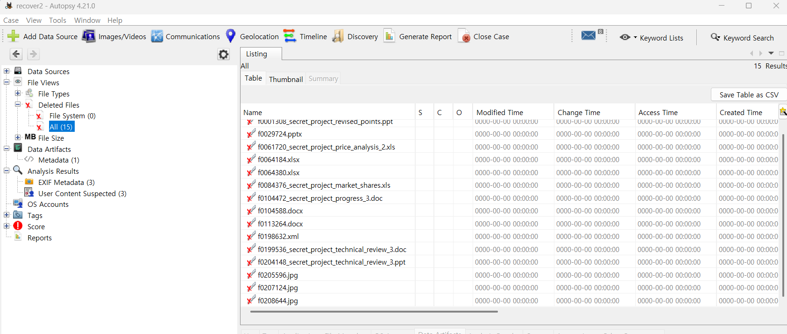
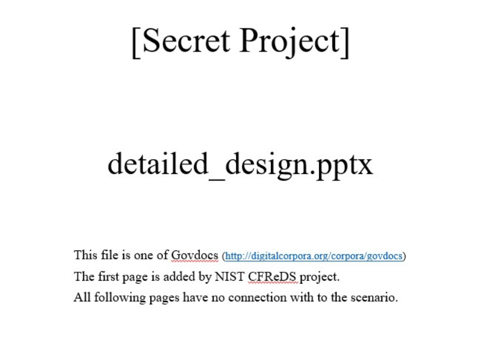

56. Recover hidden files from the CD-R ‘RM#3’. 
    How to determine proper filenames of the original files prior to renaming tasks?  

CD인, RM#3에서 숨겨진 파일들을 복구하라는 문제이다. 
추가적으로 이름 변경 작업을 수행하기 전에 원본 파일의 올바른 파일명을 확인하는 방법은 무엇인가 묻고 있다.  

 
이전 문제와 동일하게, AutoPsy를 통해서 삭제 된 파일들을 확인할 수 있었다.  

 
위 사진은 ppt 파일을 복구해본 예시이다.  
