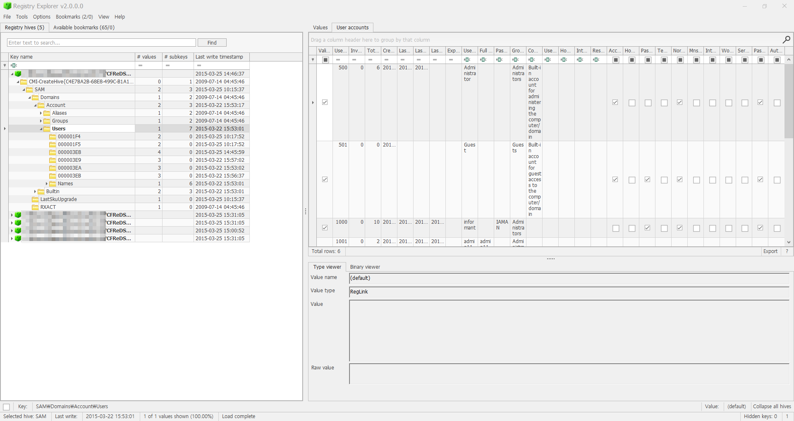
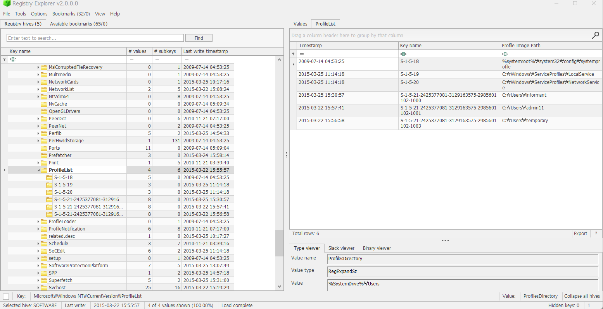

List all accounts in OS except the system accounts: Administrator, Guest, systemprofile, LocalService, NetworkService. (Account name, login count, last logon date…)  

사용자 계정 정보는 
HKEY_LOCAL_MACHINE\SAM\SAM\Domains\Account\Users 
HKEY_LOCAL_MACHINE\SOFTWARE\Microsoft\Windows NT\CurrentVersion\ProfileList  

 
all accounts : informat, temporary, ITech Team, admin1, Guest, Administrator 
이 계정들의 login count, last logon date, created on time, total login count, invalid login count 등의 정보들이 존재한다. 
사진에선 좀 짤렸다.(ㅎㅎ ㅈㅅ)  

다음으로는 
HKEY_LOCAL_MACHINE\SOFTWARE\Microsoft\Windows NT\CurrentVersion\ProfileList를 확인해 보자.  

 
system, local, network 서비스들을 수행하기 위해서 필요한 계정과 사용자 계정의 SID 값을 확인할 수 있다. 
S-1-5-18 : %systemroot%\System32\config\systemprofile 
S-1-5-19 : %systemroot%\ServiceProfiles\LocalService 
S-1-5-20 : %systemroot%\ServiceProfiles\NetworkService 
S-1-5-{21-xxx}-1002 : C\Users\informant 
S-1-5-{21-xxx}-1001 : C;\Users\admin11 
S-1-5-{21-xxx}-1003 : C:\Users\temporary  

SID는 여러 분야에서 사용되는 용어로, 주요 의미는 다음과 같다.   

1. Security Identifier (보안 식별자)  
   운영체제, 특히 Windows에서 **SID(Security Identifier)**는 사용자, 그룹, 리소스를 구분하기 위한 고유 식별자다.   

목적: 계정과 리소스에 대한 권한과 접근을 제어하기 위해 사용한다.  
형식: S-1-5-21-XXXXXXXXXX-XXXXXXXXXX-XXXXXXXXXX-YYYY 형태다.  
구성 요소:  
S: SID를 나타내는 접두사  
1: SID의 버전 번호  
5: 권한 기관(Authority Level)  
나머지 숫자: 도메인 또는 시스템을 식별하는 식별자  
예시:   

S-1-5-18: 로컬 시스템 계정  
S-1-5-32-544: 관리자 그룹  
용도: 파일 접근 권한, Active Directory 사용자 관리, 프로그램 인증 등에 사용된다.  
