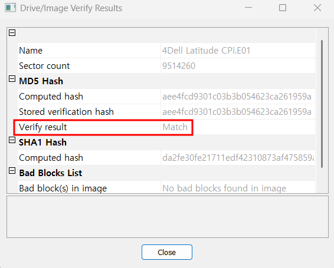
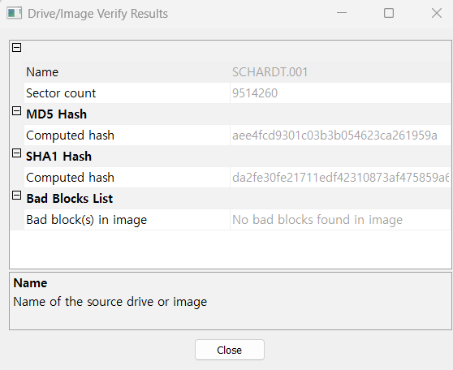

1. What is the image hash? Does the acquisition and verification hash match?  

다시 쉬운 부분으로 돌아왔다. ㅎ 이미지 해쉬가 무엇이냐고 묻고 있으며 획득 시에 생성된 해시와 검증 해시가 일치하는 지 묻고 있다.  
 
이미지 파일의 verify가 'Match'인 모습이다.  

 
DD 이미지의 verify 모습이다.
