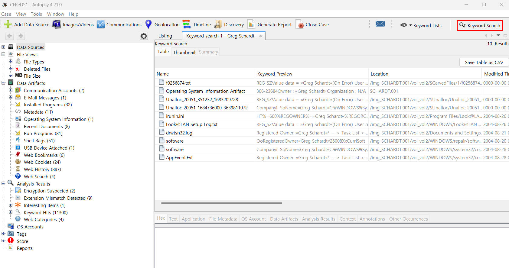

12. A search for the name of “G=r=e=g S=c=h=a=r=d=t” reveals multiple hits. One of these proves that G=r=e=g S=c=h=a=r=d=t is Mr. Evil and is also the administrator of this computer. What file is it? What software program does  

"G=r=e=g S=c=h=a=r=d=t"라는 이름을 검색하면 여러 결과가 나타납니다. 이 중 하나는 G=r=e=g S=c=h=a=r=d=t가 "Mr. Evil"이며, 또한 이 컴퓨터의 관리자(administrator)임을 증명하는 것이다. 
해당 파일은 무엇이며, 어떤 소프트웨어 프로그램이 이와 관련이 있는 지 찾아내면 된다.  

문제에서 'Greg Schardt'라는 이름을 검색해보라고 했으니 Autopsy를 이용해서 검색을 해보자.  

 
빨간색 네모가 쳐진 부분에 Greg Schardt로 키워드 검색을 할 수가 있으며 
그로 인한 결과들이 아래에 있다.  

이 중 irunin.ini 파일이 있는데, 해당 파일은 Look@LAN이라는 네트워크 모니터링 소프트웨어의 설치 및 실행과 관련된 설정 파일이다.  

해당 설정 파일에서 알 수 있는 정보들을 정리해보면, 

# 📌 주요 정보 요약

## 1️⃣ 설치된 프로그램: Look@LAN

- `%PRODUCTNAME% = Look@LAN` → **Look@LAN**이라는 네트워크 모니터링 프로그램이 설치됨.
- `%PRODUCTVER% = 2.50 Build 29` → 버전: **2.50 빌드 29**
- `%COMPANYNAME% = Carlo Medas` → 개발자 이름: **Carlo Medas**
- `%INFOURL% = http://www.lookatlan.com` → 공식 사이트: [Look@LAN](http://www.lookatlan.com)

---

## 2️⃣ 컴퓨터 관리자 이름과 사용자 정보

- **관리자(Administrator) 이름** → `Greg Schardt`
- **로그인 계정 이름** → `"Mr. Evil"`
- **컴퓨터 호스트명** → `%LANHOST% = N-1A9ODN6ZXK4LQ`
- **도메인 정보** → `%LANDOMAIN% = N-1A9ODN6ZXK4LQ`
- **사용자 IP 주소** → `192.168.1.111` (로컬 네트워크 IP)
- **네트워크 인터페이스(MAC 주소)** → `0010a4933e09`

### 📌 💡 주의:

- `"Mr. Evil"`이라는 이름이 사용자 환경 변수에 설정되어 있음.
- **관리자 권한이 있는 사용자** (`%ISUSERNTADMIN% = TRUE`)  
  → 이 컴퓨터에서 최고 권한을 가진 계정임.
- **설치된 운영체제** → `%ISWINXP% = TRUE`  
  → **Windows XP 사용 중.**

---

## 3️⃣ 파일 경로 및 설치 관련 정보

- `irunin.ini`는 설치 과정에서 설정된 환경 변수들을 저장하는 파일이며,  
  관련된 다른 설정 파일들이 다음 위치에 존재함:
  - **설치 설정 파일**: `C:\Program Files\Look@LAN\irunin.dat`
  - **언어 파일**: `C:\Program Files\Look@LAN\irunin.lng`
  - **이미지 파일**: `C:\Program Files\Look@LAN\irunin.bmp`
- **설치 프로그램 실행 경로**
  - `C:\Documents and Settings\Mr. Evil\Desktop\lalsetup250.exe`
      

요 정도가 되겠다.  
