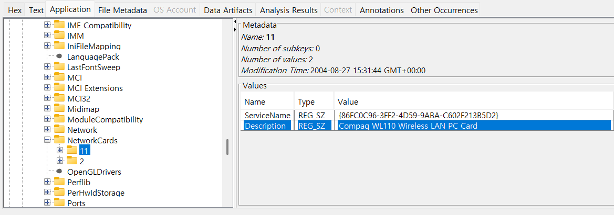
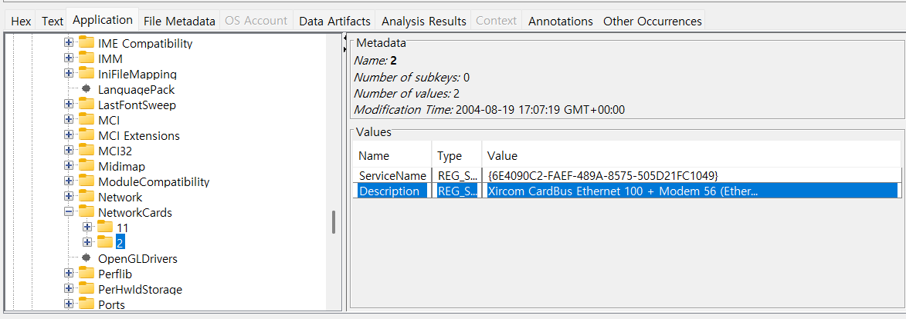

13. List the network cards used by this computer 
14. This same file reports the IP address and MAC address of the computer. What are they? 
15. An internet search for vendor name/model of NIC cards by MAC address can be used to find out which network  

13번은 이 컴퓨터에서 사용된 네트워크 카드를 나열하라는 문제이고,  
14번 문제는 동일한 파일에서 이 컴퓨터의 IP 주소와 MAC 주소를 보고하는데 해당 값은 무엇인지 묻고 있다. 
15번 문제는 MAC 주소를 이용해 네트워크 인터페이스 카드(NIC)의 제조사 및 모델을 인터넷 검색을 통해 확인할 수 있다고 말하고 있다.  

우선, 네트워크 카드 정보가 어디에 존재하는 레지스터로부터 얻을 수 있을 지 보자. 
2가지를 살펴 볼 수 있는데, 
네트워크 카드 목록 관련 레지스트리 
HKEY_LOCAL_MACHINE\SOFTWARE\Microsoft\Windows NT\CurrentVersion\NetworkCards 
네트워크 설정 관련 레지스트리 
HKEY_LOCAL_MACHINE\SYSTEM\ControlSet001\services\Tcpip\Parameters\Interfaces  

이렇게 있다.  
 
Compaq WL110 Wireless LAN PC Card 하나,  

 
Xircom CardBus Ethernet 100 + Modem 56 (Ethernet Interface) 
하나 해서, 총 2가지를 찾을 수 있었다.  
