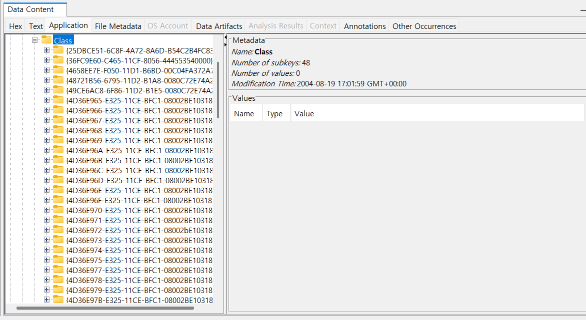
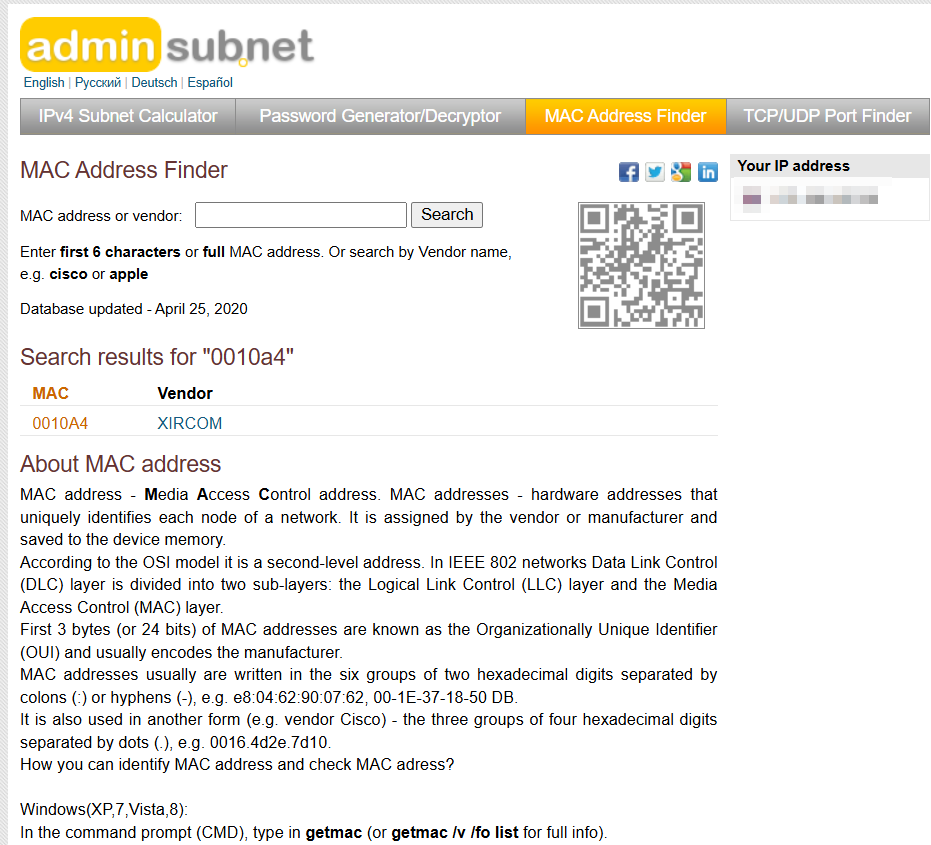

13. List the network cards used by this computer<br>
14. This same file reports the IP address and MAC address of the computer. What are they?<br>
15. An internet search for vendor name/model of NIC cards by MAC address can be used to find out which network<br><br>

13번은 이 컴퓨터에서 사용된 네트워크 카드를 나열하라는 문제이고, <br>
14번 문제는 동일한 파일에서 이 컴퓨터의 IP 주소와 MAC 주소를 보고하는데 해당 값은 무엇인지 묻고 있다.<br>
15번 문제는 MAC 주소를 이용해 네트워크 인터페이스 카드(NIC)의 제조사 및 모델을 인터넷 검색을 통해 확인할 수 있다고 말하고 있다.<br><br>

우선, 네트워크 카드 정보가 어디에 존재하는 레지스터로부터 얻을 수 있을 지 보자.<br>
2가지를 살펴 볼 수 있는데,<br>
네트워크 카드 목록 관련 레지스트리<br>
HKEY_LOCAL_MACHINE\SOFTWARE\Microsoft\Windows NT\CurrentVersion\NetworkCards<br>
네트워크 설정 관련 레지스트리<br>
HKEY_LOCAL_MACHINE\SYSTEM\ControlSet001\services\Tcpip\Parameters\Interfaces<br><br>

이렇게 있다.<br><br>
<br>
Compaq WL110 Wireless LAN PC Card 하나,<br><br>

<br>
Xircom CardBus Ethernet 100 + Modem 56 (Ethernet Interface)<br>
하나 해서, 총 2가지를 찾을 수 있었다.<br><br>

14번 문제에 접근하기 위해, 네트워크 설정 관련 레지스트리를 방문해보았지만,<br>
<br>
위 사진과 같이 IP 주소가 확인되지 않고 있다.<br><br>

<br>
그러나, Controlset001이 아닌 Controlset002의 같은 경로에서는 IP 주소를 획득할 수 있었다.<br><br>

<br>
둘의 차이점을 간단하게 정리해보았다.<br><br>

15번 문제는 MAC 주소를 이용해 네트워크 인터페이스 카드(NIC)의 제조사 및 모델을 인터넷 검색을 통해 확인할 수 있다는데, 우선 MAC 주소를 찾아보자.<br><br>

\HKEY_LOCAL_MACHINE\SYSTEM\ControlSet001\Control\Class\에는 PC에 연결된 모든 하드웨어에 대한 정보들이 존재한다.<br><br>

<br>
겁나 많네....<br><br>

이 수많은 친구들 중, 4D36E972-E325-11CE-BFC1-08002BE10318 <- 임마를 볼 것이다.<br>
이 친구는 네트워크 어댑터의 정보를 나타내며 네트워크주소 부분에 mac이 적혀있기 때문이다..../?<br>
보다보니 NetworkAddress 관련 정보가 없어서 다른 곳에서 답을 얻으려고 한다.<br><br>


12번 문제에서 irunin.ini를 확인했던 곳에서 힌트를 얻었다.<br><br>

# 🛠️ MAC 주소란?

- 각 네트워크 카드(NIC)는 고유한 **MAC 주소**를 가짐.
- 일반적으로 **6바이트(48비트) 길이**의 16진수 값으로 구성됨.
- 보통 `00-10-A4-93-3E-09` 또는 `00:10:A4:93:3E:09` 형식으로 표현됨.
- **제조사 정보 포함:**
  - **첫 3바이트(24비트)** → 제조사 식별 코드 (OUI, **Organizationally Unique Identifier**)
  - **마지막 3바이트(24비트)** → 장치 고유 식별자

---

# 🔹 `%LANNIC%` 값으로 네트워크 카드 제조사 찾기

## ✅ 제조사 확인 방법 (OUI 검색)

MAC 주소의 **처음 3바이트 (OUI)** 를 통해 네트워크 카드 제조사를 확인할 수 있음.

### **1️⃣ OUI(Organizationally Unique Identifier) 데이터베이스에서 확인**

- [IEEE OUI 검색](https://standards.ieee.org/products-services/regauth/oui/)
- [Wireshark OUI Lookup](https://www.wireshark.org/tools/oui-lookup.html)

### **2️⃣ 명령어로 확인**

#### **🔹 Windows (PowerShell)**

```powershell
getmac /v /fo list
```

<br><br>

<br>
앞자리 6글자를 검색해보니 다음과 같은 정보가 나왔다.<br><br>

14번에 대한 답은 그래서 다음과 같게 된다.<br>
192.168.1.111<br>
0010a4933e09<br>
