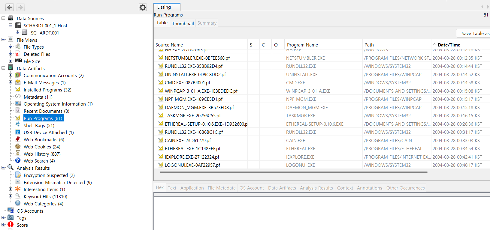

Find 6 installed programs that may be used for hacking.  

해킹을 위해서 사용된 것 같은 6개의 설치된 프로그램을 찾으면 된다  

우선, evil이라는 계정이 2004년 8월 20일에 생성되었다는 것을 6번 문제를 통해서 알아냈으니, 그 이후에 생성이 된 파일들로 범주를 줄일 수가 있다.  

 
Run Programs라는 메뉴에서 실행된 프로그램들을 날짜별로 확인할 수 있었는데 간단하게 정리해보았다.  

### 1. **Anonymizer Bar**

- 익명성을 유지하며 인터넷을 탐색할 수 있도록 도와주는 웹 브라우저 툴바.

### 2. **Cain & Abel**

- 네트워크 패킷 분석 및 패스워드 복구를 위한 강력한 툴.
- 로컬 네트워크에서 패스워드를 스니핑하고 크래킹할 수 있음.

### 3. **Look@LAN**

- 로컬 네트워크를 스캔하고 장치의 상태를 모니터링하는 네트워크 툴.

### 4. **Network Stumbler**

- 무선 네트워크를 검색하고 신호 강도를 측정하는 Wi-Fi 분석 도구.

### 5. **WinPcap**

- 네트워크 패킷을 캡처하는 라이브러리 및 드라이버.
- Wireshark 같은 패킷 분석 도구에서 사용됨.

## 파일 관리 및 FTP 관련 프로그램

### 6. **CuteFTP**

- FTP, FTPS, SFTP 프로토콜을 지원하는 파일 전송 클라이언트.

### 7. **CuteHTML**

- 간단한 HTML 편집기.
- 기본적인 웹 개발 작업을 지원.

## 데이터 및 시스템 관리 도구

### 8. **Faber Toys**

- 시스템 모니터링 및 프로세스 분석 도구.
- 실행 중인 프로그램과 레지스트리 정보를 확인 가능.

### 9. **123 Write All Stored Passwords**

- 시스템에 저장된 패스워드를 한 번에 확인할 수 있는 프로그램.

## 커뮤니케이션 및 채팅 프로그램

### 10. **Forte Agent**

- 뉴스그룹 및 이메일 클라이언트 프로그램.

### 11. **mIRC**

- IRC(Internet Relay Chat) 기반의 채팅 프로그램.
- 스크립팅 기능을 제공하여 자동화 가능.

## 시스템 관련 도구

### 12. **PowerToys for Windows XP**

- Windows XP 사용자를 위한 추가 기능 제공.
- 창 정렬, 빠른 명령어 실행 등 다양한 생산성 도구 포함.
    

대충 시나리오를 생각해보면, 

1. 공격자가 Anonymizer를 통해서 IP를 은닉하고 
2. NetStumbler를 통해 Wifi 탐색을 한 뒤, 
3. Look&LAN_1.0, Ethereal을 통해서 네트워크 관련 정보를 수집하였으며 
4. Cain & Abel v2.5 beta45와 123 Write All Stored Passwords를 통해 패스워드를 cracking 한 것으로 보인다.
