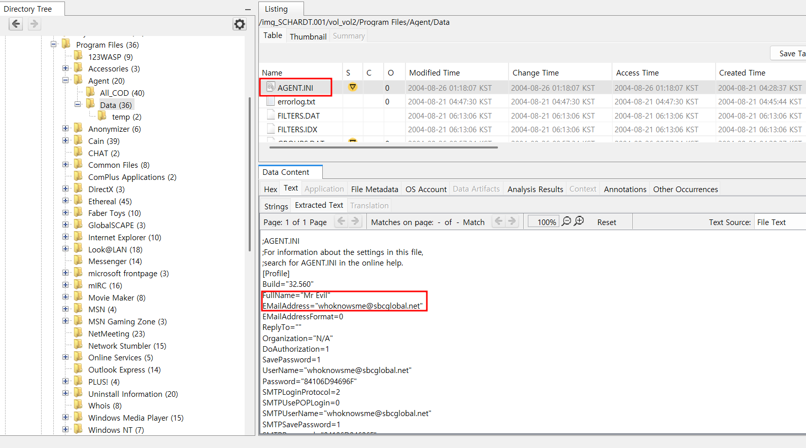
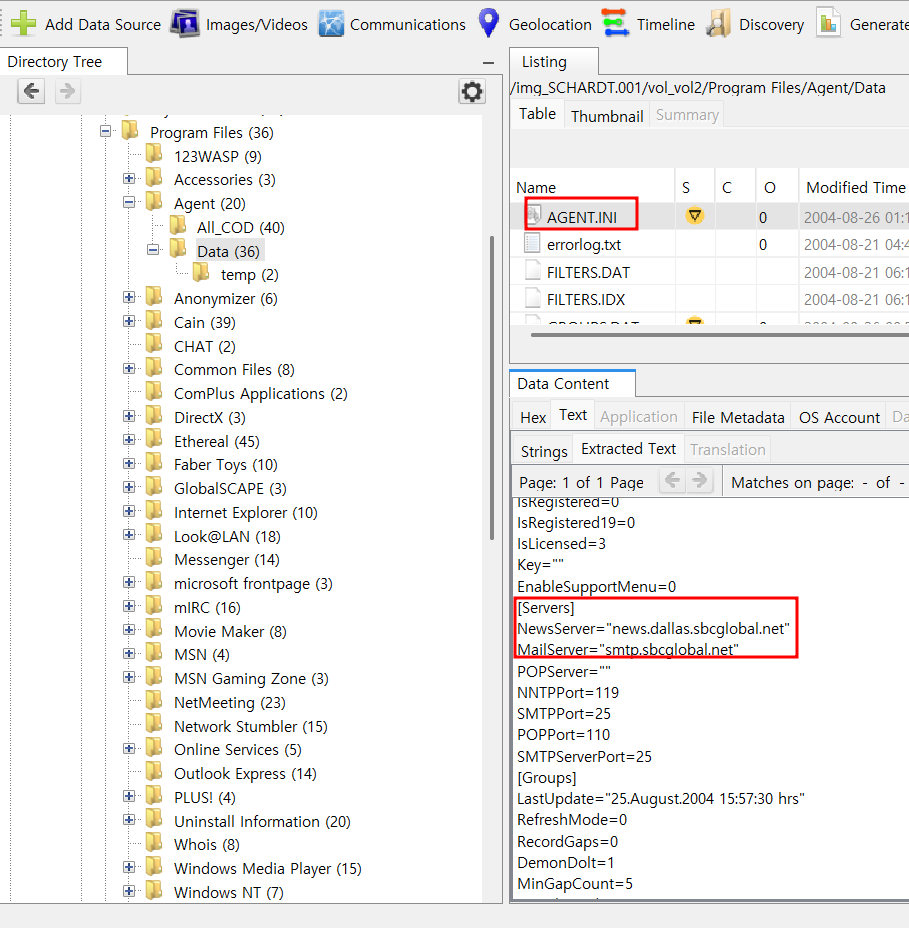

17. What is the SMTP email address for Mr. Evil? 
18. What are the NNTP (news server) settings for Mr. Evil?  

각 문제는, Mr. Evil의 SMTP 이메일 주소는 무엇인가/Mr. Evil의 NNTP(뉴스 서버) 설정은 무엇인가를 묻고 있다.  

메일 관련 레지스트리의 위치는 다음과 같다. 
HKEY_LOCAL_MACHINE\SOFTWARE\Clients\Mail  

SMTP, NTTP 관련 설정 파일은 다음과 같다. 
C:\Program Files\Agent\Data\AGENT.INI  

 
SMTP, NTTP 관련 설정 파일을 확인 해 본 사진이다. 
FullName="Mr Evil" 밑에 Evil의 메일 주소가 whoknowsme@sbcglobal.net으로 나와있다.  

 
그 밑에서는 NTTP 서버 주소가 news.dallas.sbcglobal.net이라는 것을 확인할 수 있다.
