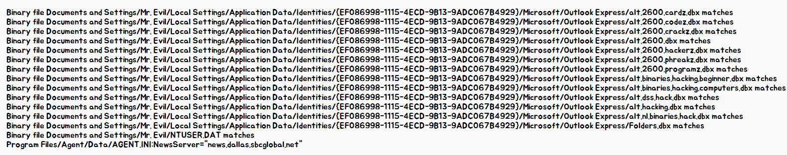

19. What two installed programs show this information?  

이 정보를 보여주는 두 개의 설치된 프로그램은 무엇인가를 묻고 있다.  

 
위 명령어를 통해서, "News.dallas.sbcglobal.net"이라는 문자열이 포함되어 있는 파일 목록을 gotyou.txt로 출력을 할 예정이다.  

Arsenal Image Mounter를 사용하여 Write Temporary 메뉴를 통해 추가 임시 드라이브를 생성하고 해당 드라이브로 이동하여 관리자 권한을 가지고 명령어를 실행시키면 된다.  

gotyou.txt의 내용은 같이 업로드해두겠다.  

 
확인하기 어려운 사람들을 위해, 이미지로 살짝 보자면 Forte Agent, Outlook Express 폴더 경로에서 발견이 되었다. 즉 두 프로그램은 Forte Agent, Outlook Express이다.  
