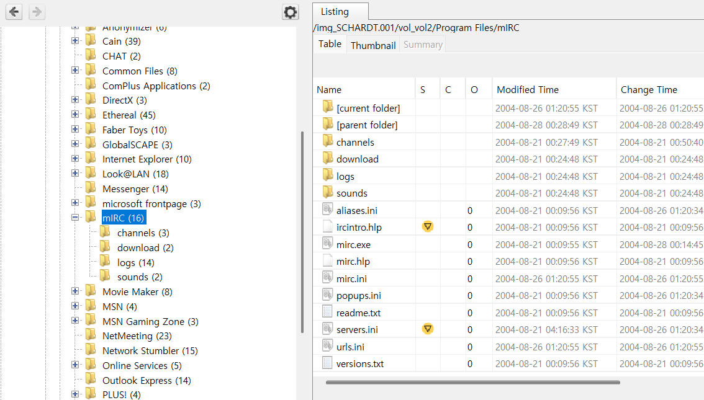
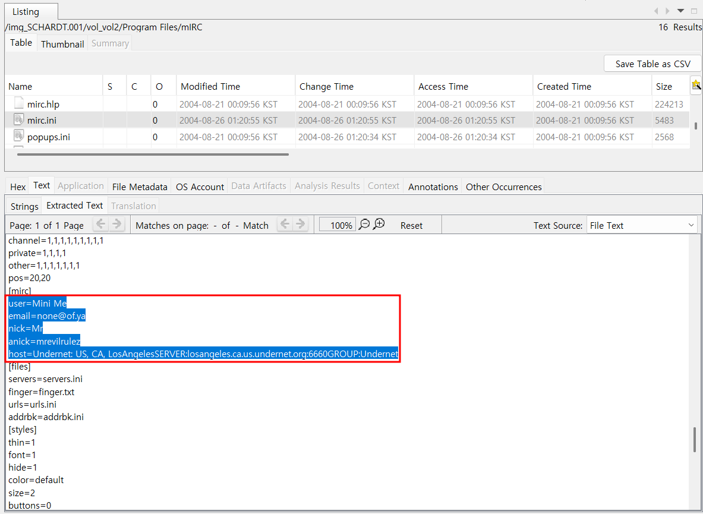
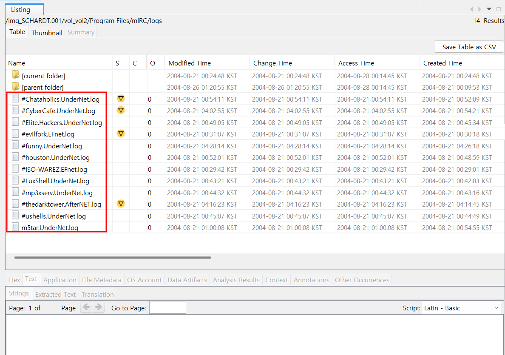

21. A popular IRC (Internet Relay Chat) program called MIRC was installed. What are the user settings that was shown when the user was online and in a chat channel?  

Internet Relay Chat 프로그램인 MIRC가 설치되었고 사용자가 온라인 상태이며 채팅 채널에 있을 때 표시되는 사용자 설정이 무엇인지 묻고 있다.  

환경설정 파일인 ini 파일들을 확인해 볼 것이다.  

mIRC 폴더의 위치는 Program Files\mIRC와 같다. 
이제 이곳에서 ini 관련 파일들을 살펴볼 건데, mirc.ini 파일을 살펴보자.  

 
다음과 같이 빨간 네모가 쳐진 곳에서 user setting 관련 정보를 확인할 수 있었다.  

22. This IRC program has the capability to log chat sessions. List 3 IRC channels that the user of this computer accessed.  

이 IRC 프로그램은 채팅 세션을 기록하는 기능을 가지고 있는데, 이 컴퓨터 사용자가 접속한 IRC 채널 3개를 나열하라는 문제이다.  

21번 문제에서 확인했던 mIRC 폴더에는 logs가 존재한다. 
해당 폴더를 확인해보면 IRC 채널들이 나온다. 3개 고르면 된다. 
