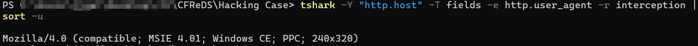

23. Ethereal, a popular “sniffing” program that can be used to intercept wired and wireless internet packets was also found to be installed. When TCP packets are collected and re-assembled, the default save directory is that users \My Documents directory. What is the name of the file that contains the intercepted data?  
24. Viewing the file in a text format reveals much information about who and what was intercepted. What type of wireless computer was the victim (person who had his internet surfing recorded) using?  
25. What websites was the victim accessing?   

각각의 문제는  23. Ethereal은 유선 및 무선 인터넷 패킷을 가로챌 수 있는 인기 있는 "스니핑" 프로그램으로, 이 프로그램이 설치된 것이 발견되었다. TCP 패킷이 수집되어 재조립될 경우, 기본 저장 디렉터리는 사용자 내 문서 폴더이다. 가로챈 데이터를 포함하는 파일의 이름은 무엇인가?  

24. 이 파일을 텍스트 형식으로 열어보면, 누가 어떤 데이터를 가로챘는지에 대한 많은 정보를 확인할 수 있다. 인터넷 활동이 기록된 피해자는 어떤 종류의 무선 컴퓨터를 사용하고 있었는가?  

25. 피해자가 접속한 웹사이트는 무엇인가?를 묻고 있다.  

우선 23번은 \Documents and Settings\Mr.Evil 폴더의 interception을 확인해 볼 것이다. 

  
Interception(인터셉션) 파일은 네트워크에서 가로챈 패킷을 저장한 파일을 의미한다. 
일반적으로 패킷 스니핑(Packet Sniffing) 도구(예: Wireshark, Ethereal)를 사용하여 캡처된 네트워크 데이터를 저장한 파일을 가리킨다.  

24번 문제에서는 피해자가 어떤 종류의 무선 컴퓨터를 사용하고 있는지 묻고 있다. 

 
다음 이미지는 interception 파일을 Wireshark를 이용해서 열은 화면이다. 
http.user_agent로 필터를 씌워놓고 User-Agent 부분을 확인해보았다.  

 
명령어로 뽑아낸 모습.  

25번에서는 피해자가 어떤 사이트들을 이용하고 있는지 묻고 있다.  

 
이번에는 Wireshark에서 http.host로 필터를 걸어놓고 http 패킷의 host 영역을 분석하면 된다.  

 
이렇게 명령어로 직접 뽑아낼 수도 있다.
