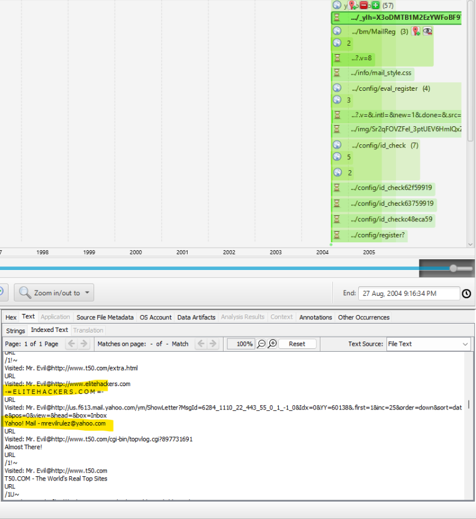

26. Search for the main users web based email address. What is it?  

주요 사용자의 웹 기반 이메일 주소를 찾으라는 것 같다...  

 
찾는 데 애좀 먹었다.. 
웹 기록은 1989년부터 시작해서 887개의 항목이 존재했기에 타임라인 필터링을 활용하여, 사건이 발생한 시점인 2004년으로 검색 범위를 제한하였고, 
Limit event types to -> Web Activity 옵션을 사용하여 웹 활동 이벤트만 필터링하였다. 

 
쨔잔~
