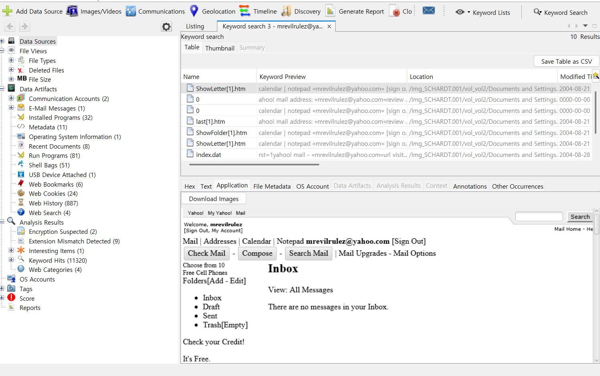

Yahoo mail, a popular web based email service, saves copies of the email under what file name?  

Yahoo Mail은 인기 있는 웹 기반 이메일 서비스이다. 
그렇다면, Yahoo Mail은 이메일의 사본을 어떤 파일 이름으로 저장하는가?  

#26번 문제에서 용의자의 email 주소가 mrevilrulez@yahoo.com이었던 것을 기억해보자.  

이를 키워드로 검색을 해보면 되는데,  

 
mrevilrulez@yahoo.com를 키워드로 해서 검색을 하여 다음과 같은 결과가 나왔다. 
 
검색 결과에서 모든 파일을 확인한 후, Yahoo가 이메일 사본을 저장하는 파일이 **"ShowLetter[1].htm"**임을 발견했다.
