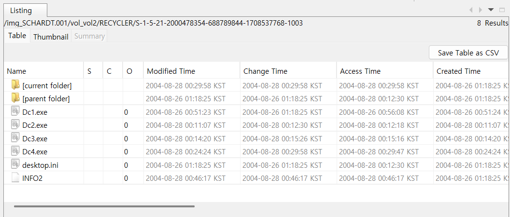
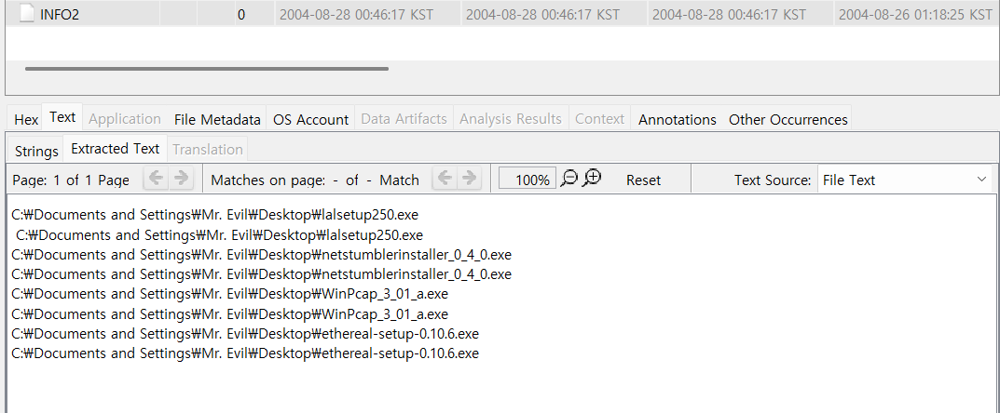

28. How many executable files are in the recycle bin?<br>
29. Are these files really deleted?<br>
30. How many files are actually reported to be deleted by the file system?<br><br>

28번 문제는 휴지통에 존재하는 실행 파일들의 개수를 묻고 있다.<br><br>

# 운영체제별 휴지통 경로 정리

## 🖥️ Windows

### Windows 10 / 11 / 8 / 7 / Vista / XP

- **휴지통 기본 경로**:
  - `C:\$Recycle.Bin\` (숨김 시스템 폴더)
- **사용자별 휴지통 경로**:
  - `C:\$Recycle.Bin\S-1-5-XX-XXXXXXXXXX-XXXXXXXXXX-XXXXXXXXXX-XXXX`
- **Windows XP 및 이전 버전**:
  - `C:\Recycler\` (숨김 시스템 폴더)

---

## 🍏 macOS

### 모든 버전

- **개별 사용자 휴지통 경로**:
  - `/Users/<사용자이름>/.Trash/`
- **루트 휴지통 (관리자 계정에서 사용 가능)**:
  - `/Volumes/<드라이브이름>/.Trashes/`
- **외장 드라이브 및 네트워크 드라이브 휴지통**:
  - `/Volumes/<드라이브이름>/.Trashes/501/`  
    _(501은 사용자 ID에 따라 달라질 수 있음)_

---

## 🐧 Linux

### 배포판별 기본 휴지통 경로 (XDG 표준 준수)

- **사용자별 휴지통 경로**:
  - `~/.local/share/Trash/`
- **세부 디렉터리 구조**:
  - `~/.local/share/Trash/files/` → 삭제된 파일 저장
  - `~/.local/share/Trash/info/` → 삭제된 파일 정보 저장 (`.trashinfo` 확장자)

---

## 📌 참고

- 일부 시스템에서는 휴지통이 숨김 폴더로 설정되어 있어 탐색기나 터미널에서 보이지 않을 수 있음.
- Windows에서 `$Recycle.Bin` 또는 `Recycler` 폴더를 보기 위해서는 숨김 파일 및 시스템 파일 표시 설정을 변경해야 함.
- macOS와 Linux에서는 `ls -a` 명령어를 사용하면 숨김 폴더도 확인 가능.
  <br><br>

<br>
해당 경로를 따라간 결과, Dc1~4까지 총 4개의 실행 파일이 존재한다.<br><br>

29번 문제에서는 이 파일들은 정말 삭제된 것인지 묻고 있다.<br><br>

# 휴지통에 있는 파일들은 정말 삭제된 것인가?

## ❌ **휴지통에 있는 파일들은 실제로 삭제된 것이 아님**

휴지통에 있는 파일들은 운영체제에서 특정 폴더(`$Recycle.Bin`, `.Trash`, `~/.local/share/Trash/files/` 등)로 **이동된 상태**일 뿐, **파일 시스템에서 완전히 제거된 것이 아님**.  
즉, 파일이 원래 위치에서 사라졌을 뿐이지, **데이터는 디스크에 여전히 남아 있음**.

---

## 📌 **휴지통에서의 파일 삭제 과정**

### 1️⃣ 삭제 (휴지통으로 이동)

- 파일이 원래 위치에서 보이지 않지만, 운영체제의 **휴지통 폴더**로 이동됨.
- 저장된 디스크 공간은 그대로 유지되며, 필요한 경우 **복원 가능**.

### 2️⃣ 휴지통 비우기

- 파일 목록이 삭제되지만, **디스크에는 데이터가 남아 있음**.
- 운영체제에서 **"사용 가능 공간"**으로 표시될 뿐, 덮어쓰기 전까지는 **복구 프로그램으로 복원 가능**.

### 3️⃣ 영구 삭제 (덮어쓰기)

- **SSD의 TRIM 기능**이 활성화된 경우: 삭제된 데이터가 즉시 정리될 수 있음.
- **HDD의 경우**: 덮어쓰기가 발생하기 전까지 복구 가능.
- **보안 삭제(파일 완전 삭제 프로그램 사용)**: 파일을 무작위 데이터로 덮어써서 복구 불가능하게 만듦.

---

## ✅ **파일을 완전히 삭제하려면?**

휴지통을 비우는 것만으로는 완전 삭제가 되지 않으므로, **보안 삭제 기능을 활용**해야 함.

### 🔹 Windows

- **명령어**:
  ```sh
  cipher /w:C:
  <br><br>
  ```

30번에서는 파일 시스템에서 실제로 삭제되었다고 보고된 파일의 개수는 몇 개인지 묻고 있다.<br><br>

<br>
물론, Recycle 폴더의 INFO2에서도 확인할 수 있긴 하지만, 도구를 사용해 볼 것이다.<br><br>

https://abelcheung.github.io/rifiuti2/<br>
윈도우 휴지통 분석 프로그램이다.ㅋㅋㅋ<br><br>

사용법은 간단하다. INFO2 파일을 추출한 뒤, rifiuti.exe -o output INFO2 명령어를 사용하면 된다.
