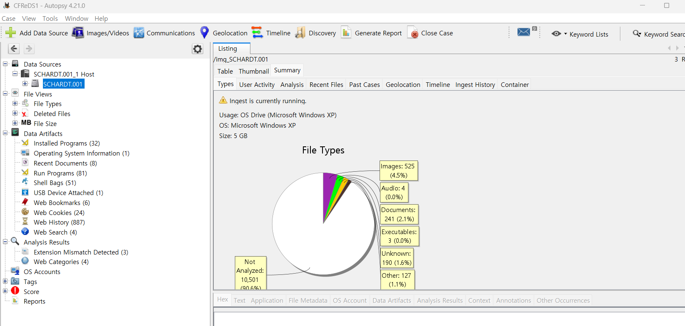

2. What operating system was used on the computer? 
3. When was the install date? 
4. What is the timezone settings? 
5. Who is the registered owner? 
6. What is the computer account name? 
7. What is the primary domain name? 
8. When was the last recorded computer shutdown date/time? 
9. How many accounts are recorded (total number)? 
10. What is the account name of the user who mostly uses the computer? 
11. Who was the last user to logon to the computer?  

각각, 컴퓨터에서 사용된 운영 체제는 무엇인가? 
설치 날짜는 언제인가? 
시간대 설정은 어떻게 되어 있나? 
등록된 소유자는 누구인가? 
컴퓨터 계정 이름은 무엇인가? 
기본 도메인 이름은 무엇인가? 
마지막으로 기록된 컴퓨터 종료 날짜/시간은 언제인가? 
기록된 계정 수(총 개수)는 몇 개인가? 
이 컴퓨터를 가장 많이 사용하는 사용자의 계정 이름은 무엇인가? 
마지막으로 이 컴퓨터에 로그인한 사용자는 누구인가?를 묻고 있다.  

우선, Registry를 추출해보려고 한다. Data Leaking Case의 #3번을 참고하면 된다.  

 
이번에는 Autopsy를 적극 기용해보려고 한다. 
SCHARDT.001 이미지 파일을 그대로 Add Data Source를 통해 업로드해주면, 위 사진에서 볼 수 있듯이, 데이터 소스 드라이브에 대한 정보를 요약해서 보여주는데, OS가 Microsoft Windows XP라고 나와있다. 따라서 2번에 대한 답은  2. Microsoft Windows XP  
