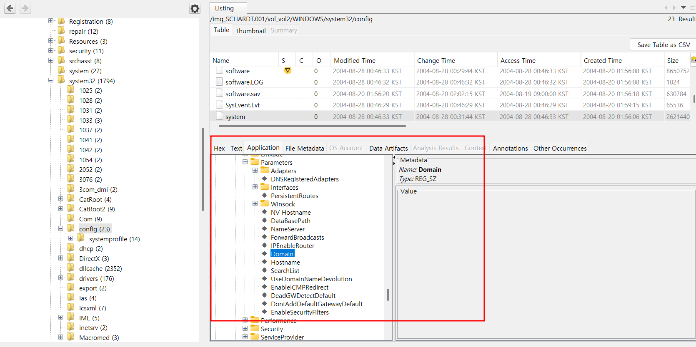
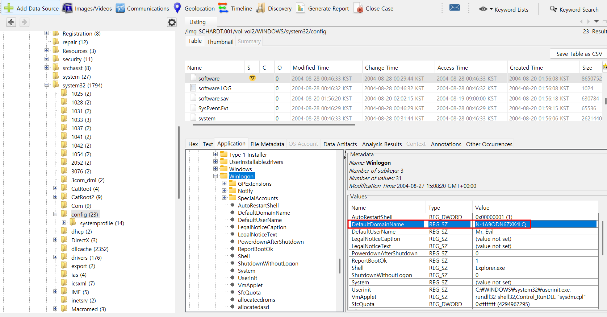
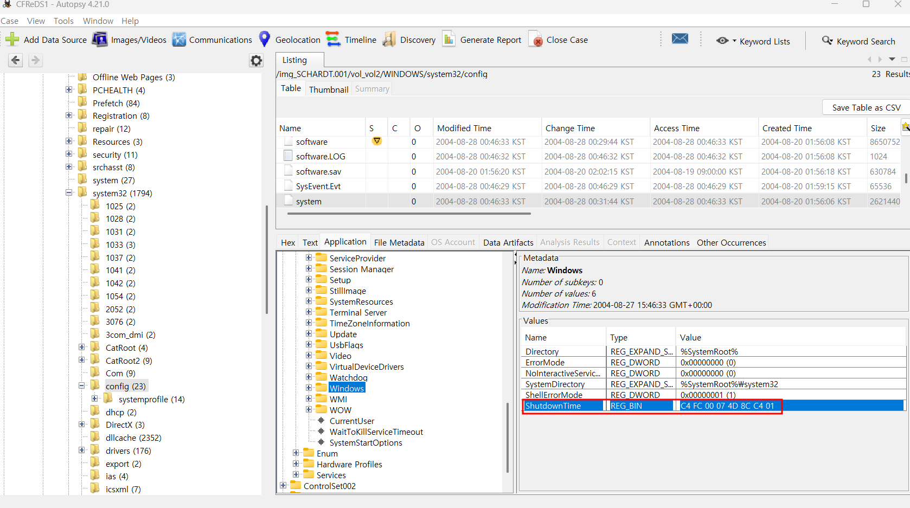
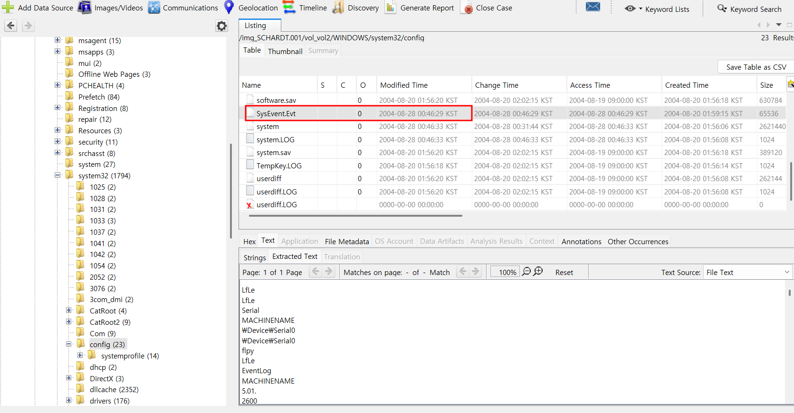
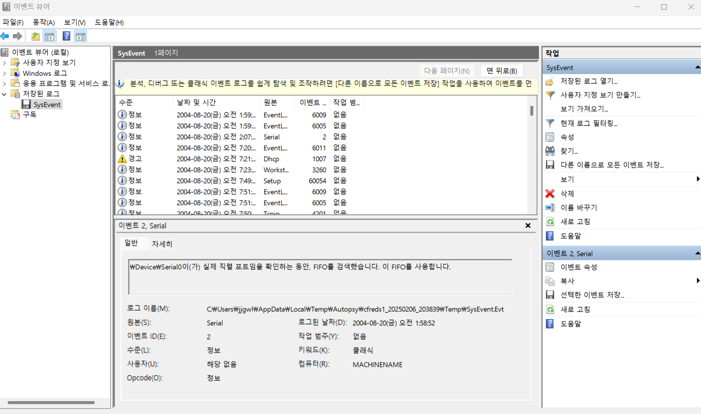
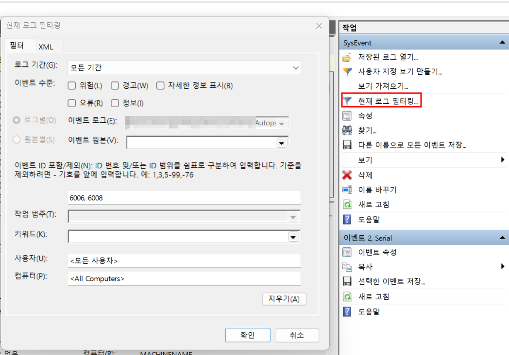
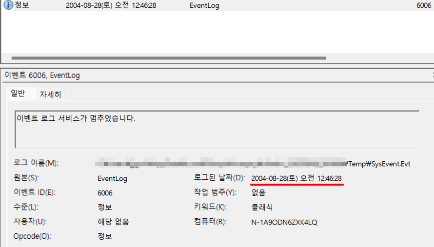

2. What operating system was used on the computer?<br>
3. When was the install date?<br>
4. What is the timezone settings?<br>
5. Who is the registered owner?<br>
6. What is the computer account name?<br>
7. What is the primary domain name?<br>
8. When was the last recorded computer shutdown date/time?<br>
9. How many accounts are recorded (total number)?<br>
10. What is the account name of the user who mostly uses the computer?<br>
11. Who was the last user to logon to the computer?<br><br>

각각, 컴퓨터에서 사용된 운영 체제는 무엇인가?<br>
설치 날짜는 언제인가?<br>
시간대 설정은 어떻게 되어 있나?<br>
등록된 소유자는 누구인가?<br>
컴퓨터 계정 이름은 무엇인가?<br>
기본 도메인 이름은 무엇인가?<br>
마지막으로 기록된 컴퓨터 종료 날짜/시간은 언제인가?<br>
기록된 계정 수(총 개수)는 몇 개인가?<br>
이 컴퓨터를 가장 많이 사용하는 사용자의 계정 이름은 무엇인가?<br>
마지막으로 이 컴퓨터에 로그인한 사용자는 누구인가?를 묻고 있다.<br><br>

우선, Registry를 추출해보려고 한다. Data Leaking Case의 #3번을 참고하면 된다.<br><br>

<br>
이번에는 Autopsy를 적극 기용해보려고 한다.<br>
SCHARDT.001 이미지 파일을 그대로 Add Data Source를 통해 업로드해주면, 위 사진에서 볼 수 있듯이, 데이터 소스 드라이브에 대한 정보를 요약해서 보여주는데, OS가 Microsoft Windows XP라고 나와있다. 따라서 2번에 대한 답은<br> 2. Microsoft Windows XP가 되게 된다. 참고로, 기본 드라이브 폴더에서 boot.ini 파일을 통해서도 확인이 가능하다.<br><br>

3번에서는 설치 날짜를 묻고 있다.<br><br>

OS를 설치한 날짜를 알기 위해서는 위도우 설치 정보가 담겨 있는 레지스트리를 찾아야 한다.<br><br>

Windows 98/ME 버전은 HKEY_LOCAL_MACHINE\SOFTWARE\Microsoft\Windows NT\CurrentVersion\FirstInstallDateTime<br><br>

Windows NT/XP/Vista/7/10 버전은 HKEY_LOCAL_MACHINE\SOFTWARE\Microsoft\Windows NT\CurrentVersion\InstallDate<br>
에서 확인할 수 있다.<br><br>

Windows NT에서 찾아야 하는데 Windows 눌러놓고 헤맸다;<br><br>

<br>
위 사진처럼 InstallDate의 Value가 0x41252e3b인 것을 확인할 수 있다.<br><br>

이를 10진수로 바꾸게 되면, 1092955707이 되며 시간 형태로 바꾸게 되면,<br>
2004년 8월 20일 16시 48분 27초 (KST)이다.<br><br>

4번에서는 시간대 설정이 어떻게 되어있는가를 묻고 있다.<br><br>

Timezone은 3번 문제에서도 알 수 있듯이,<br>
HKEY_LOCAL_MACHINE\SYSTEM\ControlSet001\Control\TimeZoneInformation<br>
해당 레지스터에서 확인이 가능하다.<br><br>

<br>
위 사진이 해당 경로이며, 시간대 설정이 Central Standard Time으로 되어있는 것을 확인할 수 있었다.<br><br>

5번 문제에서는 등록된 소유자를 묻고 있다.<br><br>

해당 문제에서 말하는 등록된 소유자는 컴퓨터를 설치할 때 입력한 사용자를, Windows 키를 누르면 나오는 사용자명을 말하는 것 같다.<br><br>

해당 정보가 남는 레지스트리는 다음과 같다.<br>
HKEY_LOCAL_MACHINE\SOFTWARE\Microsoft\Windows NT\CurrentVersion<br><br>

<br>
위 사진에서 확인할 수 있듯이, Greg Schardt 씨가 주인이다.<br>
Autopsy를 사용하고 있다면, Result -> Operating System Information -> Owner에서도 확인할 수 있다.<br><br>

<br>
위 사진을 참고하면 된다.<br><br>

6번 문제에서는 컴퓨터 계정 이름을 묻고 있다.<br>
5번 문제에서 물어본 등록된 소유자와는 다르다. 명령 프롬프트를 통해 확인할 수 있는 계정이다.<br><br>

# 컴퓨터 계정 이름과 등록된 소유자의 차이

## 1. **컴퓨터 계정 이름 (User Account Name)**

- 사용자가 Windows 또는 macOS 같은 운영체제에 로그인할 때 사용하는 계정 이름
- **종류**:
  - **로컬 계정(Local Account)**: 인터넷 없이 PC에서만 사용되는 계정
  - **마이크로소프트 계정(Microsoft Account)**: 클라우드 동기화 및 스토어 이용이 가능한 온라인 계정
  - **관리자 계정(Administrator)**: 시스템 설정 변경 권한이 있는 계정
  - **게스트 계정(Guest Account)**: 제한된 권한만 가진 임시 계정
- **확인 방법 (Windows 기준)**:
  - `Win + R` → `cmd` → `whoami` 입력
  - 또는 **제어판** → **사용자 계정**에서 확인

---

## 2. **등록된 소유자 (Registered Owner)**

- Windows 설치 시 입력된 **소유자 정보**
- 주로 초기 설정 단계에서 입력되며, Windows의 라이선스를 등록한 개인 또는 회사의 이름으로 표시됨
- 일부 프로그램에서 사용자의 소유자로 표시될 수 있음
- **확인 방법**:
  - `Win + R` → `regedit` 실행 (레지스트리 편집기)
  - `HKEY_LOCAL_MACHINE\SOFTWARE\Microsoft\Windows NT\CurrentVersion`
  - `"RegisteredOwner"` 값 확인
- **변경 방법**:
  - 위 레지스트리에서 `"RegisteredOwner"` 값을 원하는 이름으로 변경 가능

---

## 3. **주요 차이점**

| 구분               | 컴퓨터 계정 이름                    | 등록된 소유자                          |
| ------------------ | ----------------------------------- | -------------------------------------- |
| **역할**           | OS 로그인 및 사용 권한 관리         | Windows 설치 시 등록된 소유자 이름     |
| **사용 목적**      | 파일 접근, 프로그램 실행, 보안 관리 | 시스템 정보에서 소유자로 표시됨        |
| **위치**           | `C:\Users\계정이름` (사용자 폴더)   | Windows 레지스트리 (`RegisteredOwner`) |
| **변경 가능 여부** | 가능 (새 계정 생성, 이름 변경)      | 가능 (레지스트리 편집 필요)            |

---

<br><br>

해당 정보를 남기는 레지스트리의 위치는 다음과 같다.<br>
HKEY_LOCAL_MACHINE\SOFTWARE\Microsoft\Windows NT\CurrentVersion\profilelist<br><br>

<br>
S-1-5-18은 System Profiles을 나타내며, 19는 Local Service, 20은 Network Service를 나타낸다.<br><br>

위 경로가 아닌, HKEY_LOCAL_MACHINE\SAM\SAM\Domains\Account\Users 경로에서도 확인 가능하다.<br><br>

<br>
악마가 계정 이름이라니 ㄷㄷ..<br><br>

7번은 기본 도메인 이름을 묻고 있다.<br><br>

# PC에서 도메인의 정의

## 1. **도메인(Domain) 개념**

- 네트워크 환경에서 **중앙 서버(도메인 컨트롤러, DC)**가 관리하는 사용자 그룹 또는 컴퓨터 그룹
- 기업, 학교, 기관 등에서 **사용자 계정, 보안 정책, 리소스 접근**을 중앙에서 통합 관리하기 위해 사용됨

## 2. **도메인의 특징**

- **사용자 인증 (로그인 관리)**: Active Directory(AD) 서버를 통해 계정 인증
- **리소스 공유**: 같은 도메인 내에서 파일, 프린터, 네트워크 리소스 공유 가능
- **정책 적용**: 그룹 정책(GPO)을 통해 보안 및 설정 일괄 적용 가능
- **이동성**: 사용자는 여러 PC에서 같은 계정을 사용하여 로그인 가능

## 3. **도메인과 로컬 계정의 차이**

| 구분            | 도메인 계정                  | 로컬 계정             |
| --------------- | ---------------------------- | --------------------- |
| **관리 주체**   | 중앙 서버(AD)                | 개별 PC               |
| **사용자 인증** | 네트워크 로그인              | 로컬 로그인           |
| **데이터 저장** | 서버에서 계정 및 데이터 관리 | PC 내부에 데이터 저장 |
| **보안 정책**   | 그룹 정책(GPO) 적용 가능     | 개별 설정 필요        |

## 4. **도메인 확인 방법 (Windows)**

- `Win + R` → `cmd` → `whoami /upn` 또는 `systeminfo | findstr /B /C:"Domain"`
- **설정 경로**: `제어판` → `시스템 및 보안` → `시스템` → **도메인 정보 확인**

<br><br>

도메인 관련 정보를 확인할 수 있는 레지스트리는 다음과 같다.<br>
HKEY_LOCAL_MACHINE\SYSTEM\ControlSet001\Services\Tcpip\Parameters - Domain<br>
HKEY_LOCAL_MACHINE\Software\Microsoft\Windows NT\CurrentVersion\Winlogon<br><br>

<br>
첫 번째 레지스트리는 비어 있었다.<br><br>

<br>
DefaultDomainName의 Value 값은 N-1A9ODN6ZXK4LQ이다.<br><br>

8번에서는 마지막으로 기록된 컴퓨터 종료 날짜/시간은 언제인가를 묻고 있다.<br>
그렇기에, 컴퓨터 부팅과 종료에 관련된 레지스트리를 찾아보면 될 것 같다.<br><br>

해당 레지스트리는 다음과 같다.<br>
HKLM\SYSTEM\ControlSet001\Control\Windows - ShutdownTime<br>>
HKLM\Software\Microsoft\WindowNT\CurrentVersion\Prefetcher\ExitTime<br>
Windows xp: C:\Windows\System32\system32\Config<br>
Windows 7, 10: C:\Windows\System32\winevt\Logs<br><br>

<br>
우선 ShutdownTime의 Value 값을 찾아냈다.<br><br>

# Windows 레지스트리 ShutdownTime 값 변환

Windows 레지스트리의 `ShutdownTime` 값은 **Windows FILETIME** 형식(UTC 기준)으로 저장됩니다.  
주어진 `ShutdownTime` 값을 변환하는 Python 코드:

```python
import struct
import datetime

# 주어진 ShutdownTime 값 (리틀 엔디안 순서)
shutdown_time_hex = "C4FC00074D8CC401"

# 바이트 순서를 맞춰 변환 (리틀 엔디안 -> 빅 엔디안)
shutdown_time_bytes = bytes.fromhex(shutdown_time_hex)
shutdown_time_int = struct.unpack("<Q", shutdown_time_bytes)[0]

# Windows FILETIME 기준 (1601-01-01)에서 경과된 100ns 단위 시간 변환
filetime_epoch = datetime.datetime(1601, 1, 1, tzinfo=datetime.timezone.utc)
shutdown_datetime = filetime_epoch + datetime.timedelta(microseconds=shutdown_time_int / 10)

# 변환된 시간 출력
shutdown_datetime
```

<br<br>>
그렇게 해서, 주어진 ShutdownTime 값은 2004년 8월 27일 10시 46분 33초 (UTC 기준)이다.<br><br>

레지스트리로 찾아봤으니, 윈도우 이벤트 로그를 이용해 보자.<br><br>

<br>
이 친구를 우클릭을 하여 Open in External Viewer 옵션을 통해 이벤트 뷰어로 연다.<br><br>

<br>
이런 식으로 창이 뜨게 된다.<br><br>

# Windows 이벤트 뷰어에서 부팅 및 종료 로그 찾기

Windows 이벤트 뷰어에서 **부팅(시작), 종료(정상 종료/재부팅/예기치 않은 종료)** 관련 로그를 확인하려면 아래 이벤트 ID를 필터링하면 됩니다.

---

## 🔹 시스템 부팅 및 종료 관련 이벤트 ID

| 이벤트 ID | 설명                                                |
| --------- | --------------------------------------------------- |
| **6005**  | Windows 이벤트 로그 서비스가 시작됨 (**부팅 완료**) |
| **6006**  | Windows 이벤트 로그 서비스가 종료됨 (**정상 종료**) |
| **6008**  | 예기치 않은 종료 (블루스크린, 정전, 강제 종료 등)   |
| **6013**  | 시스템 가동 시간(업타임)                            |
| **1074**  | 사용자/프로세스에 의해 시스템이 종료되거나 재부팅됨 |
| **1076**  | 이전 시스템 종료 이유 기록 (6008과 함께 확인)       |

---

## 🖥 부팅 관련 이벤트

- **6005** : `"이벤트 로그 서비스가 시작되었습니다."` → **부팅 성공**
- **6013** : 시스템이 마지막으로 얼마나 가동되었는지 (**업타임**)

---

## ⚡ 정상 종료 관련 이벤트

- **1074** : 시스템이 정상적으로 종료됨 (사용자 또는 소프트웨어에 의해 종료됨)
  - 예시: `"사용자 XXX에 의해 시스템이 종료됨"`
  - `"Windows Update에 의해 시스템이 다시 시작됨"`
- **6006** : `"이벤트 로그 서비스가 종료되었습니다."` → **정상 종료**

---

## 🔥 비정상 종료 관련 이벤트

- **6008** : **예기치 않은 종료** (블루스크린, 정전, 강제 종료 등)
  - `"이전 시스템 종료는 예기치 않게 수행되었습니다."`
- **1076** : **이전 종료의 원인 기록** (관리자가 기록하는 경우)

---

<br><br>

그리하... 6006과 6008을 필터로 걸 예정이다.<br><br>

<br>
위와 같이 필터를 걸게 되면,<br><br>

<br>
2004년 08월 28일 오전 12시 46분 28초라는 값이 나오게 되는데, 해당 값은 KST 기준이고<br>
구해야 하는 값은 Central Time 기준이기에, Central Time 기준으로 바꾸면<br>
2004년 8월 27일 오전 10시 46분 28초이다.<br>
레지스트리로 구한 2004년 8월 27일 10시 46분 33초와 5초 정도 차이가 나는 것을 확인할 수 있었다.<br><br>

Windows 종료 과정에서 이벤트 로그가 먼저 기록된 후,<br>
커널이 마지막으로 ShutdownTime을 레지스트리에 기록하며,<br>
이후 하드웨어 종료 단계에서 남은 몇 초 동안 차이가 발생할 수 있다.<br><br>
