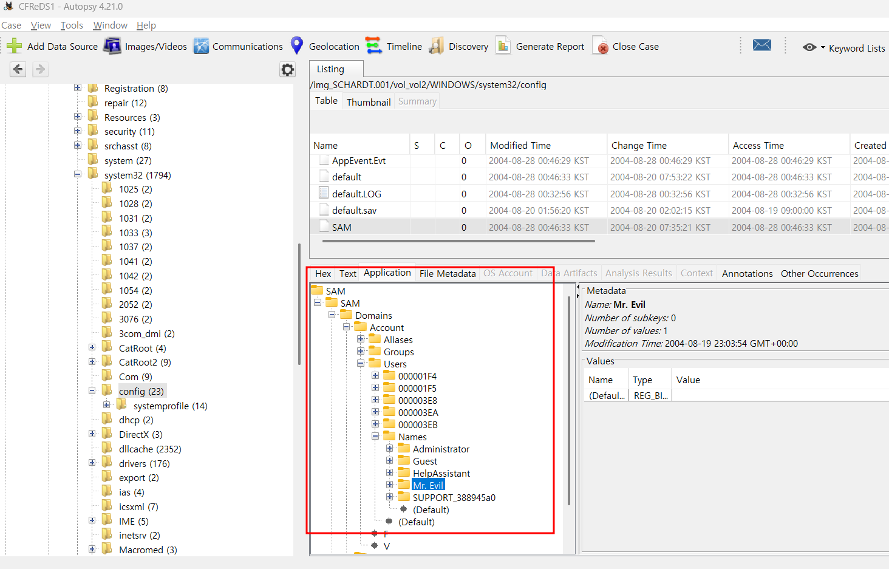

2. What operating system was used on the computer? 
3. When was the install date? 
4. What is the timezone settings? 
5. Who is the registered owner? 
6. What is the computer account name? 
7. What is the primary domain name? 
8. When was the last recorded computer shutdown date/time? 
9. How many accounts are recorded (total number)? 
10. What is the account name of the user who mostly uses the computer? 
11. Who was the last user to logon to the computer?  

각각, 컴퓨터에서 사용된 운영 체제는 무엇인가? 
설치 날짜는 언제인가? 
시간대 설정은 어떻게 되어 있나? 
등록된 소유자는 누구인가? 
컴퓨터 계정 이름은 무엇인가? 
기본 도메인 이름은 무엇인가? 
마지막으로 기록된 컴퓨터 종료 날짜/시간은 언제인가? 
기록된 계정 수(총 개수)는 몇 개인가? 
이 컴퓨터를 가장 많이 사용하는 사용자의 계정 이름은 무엇인가? 
마지막으로 이 컴퓨터에 로그인한 사용자는 누구인가?를 묻고 있다.  

우선, Registry를 추출해보려고 한다. Data Leaking Case의 #3번을 참고하면 된다.  

 
이번에는 Autopsy를 적극 기용해보려고 한다. 
SCHARDT.001 이미지 파일을 그대로 Add Data Source를 통해 업로드해주면, 위 사진에서 볼 수 있듯이, 데이터 소스 드라이브에 대한 정보를 요약해서 보여주는데, OS가 Microsoft Windows XP라고 나와있다. 따라서 2번에 대한 답은  2. Microsoft Windows XP가 되게 된다. 참고로, 기본 드라이브 폴더에서 boot.ini 파일을 통해서도 확인이 가능하다.  

3번에서는 설치 날짜를 묻고 있다.  

OS를 설치한 날짜를 알기 위해서는 위도우 설치 정보가 담겨 있는 레지스트리를 찾아야 한다.  

Windows 98/ME 버전은 HKEY_LOCAL_MACHINE\SOFTWARE\Microsoft\Windows NT\CurrentVersion\FirstInstallDateTime  

Windows NT/XP/Vista/7/10 버전은 HKEY_LOCAL_MACHINE\SOFTWARE\Microsoft\Windows NT\CurrentVersion\InstallDate 
에서 확인할 수 있다.  

Windows NT에서 찾아야 하는데 Windows 눌러놓고 헤맸다;  

 
위 사진처럼 InstallDate의 Value가 0x41252e3b인 것을 확인할 수 있다.  

이를 10진수로 바꾸게 되면, 1092955707이 되며 시간 형태로 바꾸게 되면, 
2004년 8월 20일 16시 48분 27초 (KST)이다.  

4번에서는 시간대 설정이 어떻게 되어있는가를 묻고 있다.  

Timezone은 3번 문제에서도 알 수 있듯이, 
HKEY_LOCAL_MACHINE\SYSTEM\ControlSet001\Control\TimeZoneInformation 
해당 레지스터에서 확인이 가능하다.  

 
위 사진이 해당 경로이며, 시간대 설정이 Central Standard Time으로 되어있는 것을 확인할 수 있었다.  

5번 문제에서는 등록된 소유자를 묻고 있다.  

해당 문제에서 말하는 등록된 소유자는 컴퓨터를 설치할 때 입력한 사용자를, Windows 키를 누르면 나오는 사용자명을 말하는 것 같다.  

해당 정보가 남는 레지스트리는 다음과 같다. 
HKEY_LOCAL_MACHINE\SOFTWARE\Microsoft\Windows NT\CurrentVersion  

 
위 사진에서 확인할 수 있듯이, Greg Schardt 씨가 주인이다. 
Autopsy를 사용하고 있다면, Result -> Operating System Information -> Owner에서도 확인할 수 있다.  

 
위 사진을 참고하면 된다.  

6번 문제에서는 컴퓨터 계정 이름을 묻고 있다. 
5번 문제에서 물어본 등록된 소유자와는 다르다. 명령 프롬프트를 통해 확인할 수 있는 계정이다.  

# 컴퓨터 계정 이름과 등록된 소유자의 차이

## 1. **컴퓨터 계정 이름 (User Account Name)**

- 사용자가 Windows 또는 macOS 같은 운영체제에 로그인할 때 사용하는 계정 이름
- **종류**:
  - **로컬 계정(Local Account)**: 인터넷 없이 PC에서만 사용되는 계정
  - **마이크로소프트 계정(Microsoft Account)**: 클라우드 동기화 및 스토어 이용이 가능한 온라인 계정
  - **관리자 계정(Administrator)**: 시스템 설정 변경 권한이 있는 계정
  - **게스트 계정(Guest Account)**: 제한된 권한만 가진 임시 계정
- **확인 방법 (Windows 기준)**:
  - `Win + R` → `cmd` → `whoami` 입력
  - 또는 **제어판** → **사용자 계정**에서 확인

---

## 2. **등록된 소유자 (Registered Owner)**

- Windows 설치 시 입력된 **소유자 정보**
- 주로 초기 설정 단계에서 입력되며, Windows의 라이선스를 등록한 개인 또는 회사의 이름으로 표시됨
- 일부 프로그램에서 사용자의 소유자로 표시될 수 있음
- **확인 방법**:
  - `Win + R` → `regedit` 실행 (레지스트리 편집기)
  - `HKEY_LOCAL_MACHINE\SOFTWARE\Microsoft\Windows NT\CurrentVersion`
  - `"RegisteredOwner"` 값 확인
- **변경 방법**:
  - 위 레지스트리에서 `"RegisteredOwner"` 값을 원하는 이름으로 변경 가능

---

## 3. **주요 차이점**

| 구분               | 컴퓨터 계정 이름                    | 등록된 소유자                          |
| ------------------ | ----------------------------------- | -------------------------------------- |
| **역할**           | OS 로그인 및 사용 권한 관리         | Windows 설치 시 등록된 소유자 이름     |
| **사용 목적**      | 파일 접근, 프로그램 실행, 보안 관리 | 시스템 정보에서 소유자로 표시됨        |
| **위치**           | `C:\Users\계정이름` (사용자 폴더)   | Windows 레지스트리 (`RegisteredOwner`) |
| **변경 가능 여부** | 가능 (새 계정 생성, 이름 변경)      | 가능 (레지스트리 편집 필요)            |

---

  

해당 정보를 남기는 레지스트리의 위치는 다음과 같다. 
HKEY_LOCAL_MACHINE\SOFTWARE\Microsoft\Windows NT\CurrentVersion\profilelist  

 
S-1-5-18은 System Profiles을 나타내며, 19는 Local Service, 20은 Network Service를 나타낸다.  

위 경로가 아닌, HKEY_LOCAL_MACHINE\SAM\SAM\Domains\Account\Users 경로에서도 확인 가능하다.  

 
악마가 계정 이름이라니 ㄷㄷ..  
