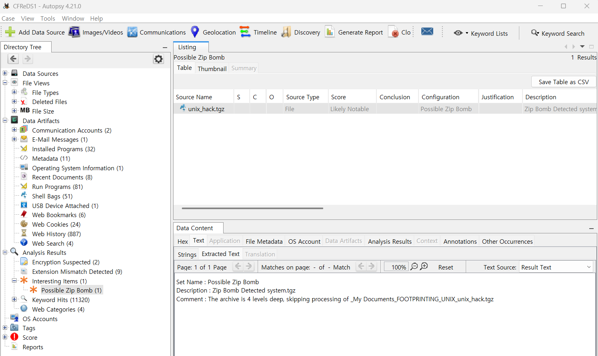

31. Perform a Anti-Virus check. Are there any viruses on the computer?  

대망의 마지막 문제이다. 
안티바이러스 검사를 수행하고 컴퓨터에 바이러스가 있는 지를 묻고 있다.  

Autopsy에는 자체적으로 안티바이러스 검사를 수행하는 기능이 있다. 검사 결과는 왼쪽의 트리 구조에서
Interesting Items에 표시가 된다. 
이미지에서 확인할 수 있듯이, ZIP 폭탄(zip bomb) 하나가 해당 이미지에서 발견되었다.  

📌 파일 위치: 
C:\My Documents\FOOTPRINTING \UNIX\unix_hack.tgz  

zip bomb에 대해 설명하자면,  

# ZIP 폭탄(ZIP Bomb)란?

**ZIP 폭탄(ZIP Bomb)**은 악성 압축 파일로, **압축을 해제하면 엄청난 용량의 데이터를 생성**하여 시스템을 마비시키는 공격 기법이다. 이는 **압축률을 극도로 높여 작은 파일 크기로 위장**하지만, 실제 압축 해제 시 기하급수적으로 커지는 특징이 있다.

---

## 🛠 ZIP 폭탄의 원리

1. **초고압축된 ZIP 파일 생성**

   - ZIP 폭탄은 일반적으로 **중첩된 압축**을 이용해 수백 MB에서 수 GB, 심지어 수 TB까지 용량이 커질 수 있다.
   - 예를 들어, 42KB ZIP 파일이 압축 해제 후 **4.5PB(페타바이트)** 가 되는 사례도 존재한다.

2. **파일을 열면 시스템 리소스 과부하 발생**
   - ZIP 폭탄을 실행하면 **파일 시스템, RAM, CPU 사용량이 폭증**하여 운영체제가 정상적으로 작동하지 않게 된다.
   - 일부 백신 소프트웨어가 자동으로 압축을 해제하여 검사하는데, 이 과정에서 ZIP 폭탄이 **백신을 다운시키는 공격**으로 사용될 수도 있다.

---

## 🔥 대표적인 ZIP 폭탄 사례

### ✅ 42.zip

- 가장 유명한 ZIP 폭탄으로, **42KB 크기의 ZIP 파일**이 압축 해제 시 **4.5PB(페타바이트)** 로 확장된다.

### ✅ ZIP 폭탄을 활용한 백신 우회 공격

- 일부 악성코드는 ZIP 폭탄을 사용해 백신이 제대로 파일을 분석하지 못하게 만들고, 백신이 충돌하도록 유도한다.

---

## ⚠ ZIP 폭탄의 위험성

✔ **일반적인 바이러스처럼 직접적인 피해(데이터 삭제, 감염)는 없지만, 시스템 다운을 유발할 수 있음**  
✔ **백신이나 보안 프로그램의 작동을 방해하여 악성코드 탐지를 어렵게 만듦**  
✔ **대용량 데이터 압축 해제를 유도해 서버를 마비시키는 DDoS 공격에 사용될 수도 있음**

---

## 🚨 ZIP 폭탄 예방 방법

🔹 **출처가 불분명한 ZIP 파일 실행 금지**  
🔹 **백신에서 ZIP 폭탄 탐지 기능 활성화**  
🔹 **ZIP 파일을 열기 전에 크기를 확인하고, 예상보다 작다면 조심할 것**  
🔹 **압축 파일 내 파일 개수 확인 (과도하게 많다면 위험 신호일 가능성 있음)**

---

## 💡 결론

ZIP 폭탄은 바이러스처럼 파일을 감염시키지는 않지만, **컴퓨터를 마비시키는 악성 파일**이다. 특히 **보안 소프트웨어를 무력화하는 공격**으로도 사용될 수 있기 때문에 주의해야 한다. ⚠
